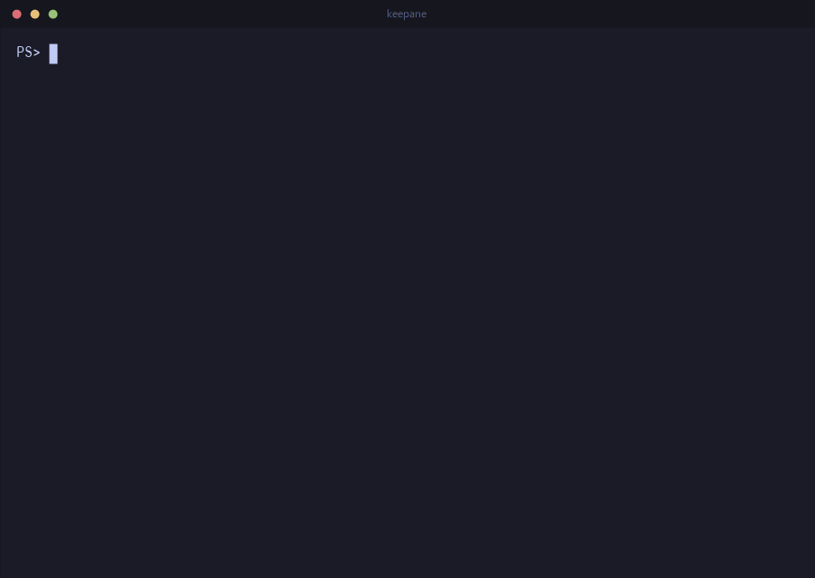
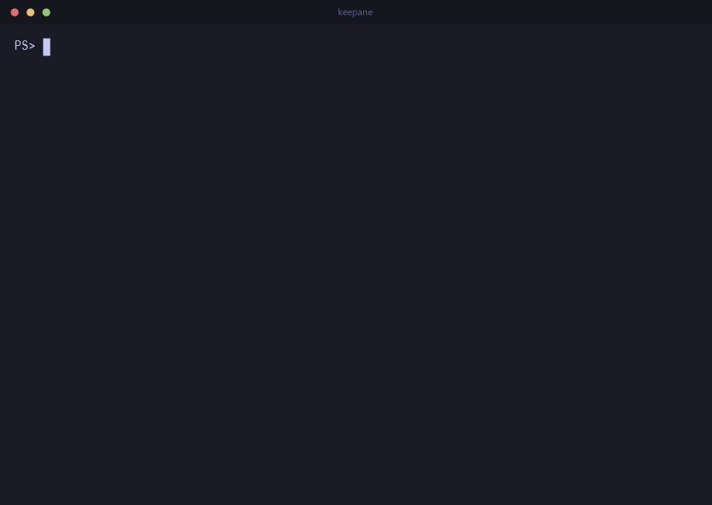
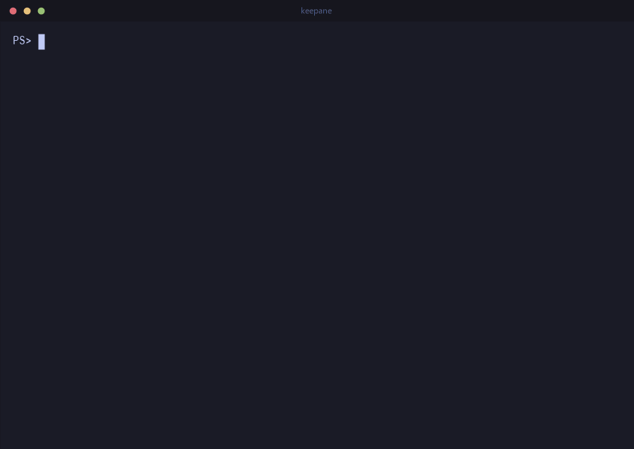

# keepane

[](https://github.com/newdee/keepane/actions/workflows/ci.yml)
[](https://github.com/newdee/keepane/releases)

[中文说明](README.zh-CN.md) · **[Feature tour →](https://dfine.tech/keepane/)**

keepane is a terminal multiplexer. The programs in its panes
keep running after the terminal connection closes, and panes can pass
messages to each other through inboxes. The usual tmux keys, commands and
config file keep working.

<p align="center">
  
</p>

- After you detach, the programs in the panes keep running. After a reboot,
  `keepane resume` brings the layout back; a pane closed by mistake comes
  back with `C-b u` within 10 seconds.
- Name a pane and you can send it messages. A message goes into the inbox
  first and is delivered when the pane is ready: a shell runs it when it
  is back at its prompt, other programs read it themselves.
- Every message carries an envelope of a fixed format, with the sender,
  the recipient and the task. The event log keeps 30 days; `C-b v` shows
  the panes, messages and tasks.
- People, scripts and AI agents use the same messages; an agent can also
  work through the built-in MCP server.
- tmux's `C-b` prefix, splits, copy mode, command line, `.tmux.conf`,
  format strings, hooks and plugins are there.

Windows is supported today (ConPTY), with PowerShell, WSL and cmd in the
panes. Linux and macOS versions are planned.

## Send work between panes

Every pane has an inbox and can be given a name. Messages queue up and are
delivered according to the receiving pane's work mode.

```powershell
keepane rename-pane -t %3 builder          # -t %builder finds it from now on
keepane set-work-mode -t %builder shell    # it runs what it gets, at its prompt (from outside keepane; inside, a pane sets its own)
keepane send-message -t %builder -w 30 "cargo test"
#12 delivered to $1:@2.%3 (shell)
keepane trace-message 12 -w 600            # waits until it is done: output, success
```

A target can be `%7` (a pane id), `%builder` (a name), or `$1:@2.%7`
(session, window and pane; `whoami` shows it). A full address also pins
where the pane is: if the pane has been moved to another window, the
delivery fails.

A pane handles messages according to its work mode:

| Mode | Ready when | Delivery |
|---|---|---|
| `normal` (default) | never on its own | read with `read-message`; the window's flags show `@` |
| `shell` | keepane's prompt hook sees the shell back at its prompt | typed in and run |
| `ai` | the agent's end-of-turn hook runs `pane-ready` | typed in as a prompt |

After someone types into a pane, keepane treats it as busy until the next
ready signal, so a message never lands in the middle of what is being
typed. If someone presses keys while a command keepane delivered is
running, the prompt that ends that command does not trigger a new message
either; what a user types ahead during a command of their own is beyond
keepane's reach.

In `ai` mode, if the agent has exited and a shell prompt shows again,
nothing is delivered. A message is delivered the way the recipient's mode
was when it was sent: text sent to an agent is never run as a shell
command, even if the mode changes in between.

Messages use one single-line envelope, with their source and route:

```text
{"keepane":1,"id":12,"task":12,"from":"$1:@1.%3","name":"lead","mode":"ai","to":"$1:@2.%7","via":"shell","hop":0}
```

Delivered to a shell, the envelope is a PowerShell comment before the
command (such as `<# … #> cargo test`) and stays in the history. Several
lines are joined into one command that runs them together, with one
result. Delivered to an agent, it is the envelope, the text and the end
line `{"keepane":1,"end":12}`. `task` ties together the order, the work and
the replies; `hop` counts how many times a message was passed on, and past
`message-hop-limit` (8 by default) it is refused, so agents cannot answer
each other in a loop.

Run inside a pane, `set-work-mode` changes only that pane; run from a
terminal outside keepane, a key or the `C-b :` prompt, it can change any
pane. So a program in a pane cannot switch another pane into `shell` mode,
which runs its messages by itself. Renaming, managing inboxes and closing
panes are not limited by this; a close can be undone with `C-b u` within
10 seconds. The rule is there to cut down on mistakes, not to isolate
processes of the same user from each other.

## The dashboard

`C-b v` or `keepane dashboard` shows every pane's mode, whether it is idle,
its inbox and its status. For the chosen pane you can see its events
(Enter), messages (`m`), tasks (`t`), its screen live (`v`) and its screen
with the scrollback (`h`). It is read-only by default. `E` enters manage
mode, where queued messages can be deleted (`d`, `u` undoes), moved (`K`,
`J`) or put first (`g`). In manage mode the top bar turns red, and it ends
by itself after 30 seconds without a key.

Messages and changes to panes are written to an event log,
`%LOCALAPPDATA%\keepane\events\<socket>\2026-09-26.jsonl`, kept for 30 days
(`event-log`, `event-log-days`, `event-log-max`). `list-tasks`,
`show-task`, `trace-message` and `list-events` read it. When the server
stops, messages not yet delivered are dropped, and the log says so. Pane
names and work modes are saved with the session. The design in detail:
[docs/design/mailbox.md](docs/design/mailbox.md).

## Install

keepane needs Windows 10 1809 or newer (for ConPTY). From the
[releases page](https://github.com/newdee/keepane/releases):

- `keepane-v<version>-windows-x86_64.zip` holds one folder,
  `keepane-v<version>-windows-x86_64`, with `keepane.exe` in it. Unzip it
  and put that folder on your `PATH`. No administrator rights needed.
- `keepane-<version>-windows-x86_64.msi` installs into `Program Files` for
  every user and puts `keepane` on the system `PATH`; it uninstalls from
  "Apps & features". It needs administrator rights (unattended:
  `msiexec /i keepane-<version>-windows-x86_64.msi /qn`).
- `keepane-<version>-windows-x86_64-user.msi` installs for you alone, into
  `%LOCALAPPDATA%\Programs\keepane`, and puts it on your `PATH`. Neither it
  nor `keepane update` needs administrator rights, so both work over SSH.

Scoop installs the zip straight from the manifest in this repository, with
no administrator rights:

```powershell
scoop install https://raw.githubusercontent.com/newdee/keepane/master/packaging/scoop/keepane.json
```

Over SSH, Windows 11 does not let the session go through a junction made
without administrator rights, and Scoop's `current` folder is one: the shim
fails with "The path cannot be traversed because it contains an untrusted
mount point". Point Scoop's shims at the version folder instead:

```powershell
scoop config no_junction true
scoop reset keepane
```

Over SSH, the per-machine MSI's permission prompt appears on a desktop where
nobody can answer it; `keepane update` says so and stops. Use the per-user
MSI, the zip or Scoop there.

WinGet manifests for the MSI are in `packaging/winget/` (validated with
`winget validate`); `winget install newdee.keepane` works once they are
merged into winget-pkgs, and until then
`winget install --manifest packaging/winget/manifests/n/newdee/keepane/<version>`
from a clone does the same. See `packaging/README.md`.

Building from source needs Rust 1.88 or newer:

```powershell
cargo install --git https://github.com/newdee/keepane --locked   # latest master
cargo install --path .                                         # a local clone
```

To build the MSI, the script downloads WiX for the occasion if it is not
installed:

```powershell
cargo build --release
pwsh -File installer/build-msi.ps1        # target\keepane-<version>-windows-x86_64.msi
```

## Everyday use

<p align="center">
  
</p>

<p align="center">
  
</p>

keepane passes keys on in Windows' own win32-input-mode, so PSReadLine
chords, `Ctrl+Space`, `Shift+Enter`, arrows with modifiers, IME input, and
vim and htop under WSL all work. It runs in Windows Terminal, the classic
console, VS Code's terminal and other Windows console hosts.

```powershell
keepane                      # new session, attached
keepane new -s work          # named session
keepane new -d -s bg wsl.exe # detached session running WSL
keepane ls                   # list sessions
keepane attach -t work       # re-attach (works from a different terminal window)
keepane send-keys -t work "git status" Enter
keepane capture-pane -p -t work   # print what the pane shows (-S -200 adds scrollback)
keepane kill-server
```

As in tmux, a command name can be any unambiguous prefix: `keepane att`,
`keepane lsp`, `keepane splitw -h`. `keepane kill` is refused, because four
commands start that way. `keepane list-commands` prints them all, and
[docs/tmux-parity.md](docs/tmux-parity.md) sets them against tmux's, command
by command and key by key.

Several panes at once: `keepane split-window -N 3` makes three more and tiles
the window (`-d` keeps the focus where it is). A window too small for all of
them keeps the ones that fit and says how many it made.

In a session, press the prefix `Ctrl+b`, then a key from this table:

| Key | Action |
| --- | --- |
| `c` / `n` / `p` / `Tab` / `0-9` | new window / next / previous / last / select by index |
| `,` / `&` | rename / kill window |
| `%` / `"` | split left-right / top-bottom |
| `h` `j` `k` `l` or arrows / `o` / `;` | move between panes (vim keys) / next pane / last pane |
| `H` `J` `K` `L`, `Alt`+arrows / `Ctrl`+arrows | resize the current pane by 5 / by 1 |
| `Shift`+arrows | when the window is bigger than this terminal (`window-size` took another client's), pan this client's view by 5 rows / 10 columns; the view follows the cursor again at the next key |
| (moving, resizing, `n` / `p` and `{` / `}` repeat: after the prefix, keep pressing the key for half a second, `repeat-time`) | |
| `S` | toggle `synchronize-panes` (type into every pane of the window; `S` flag on the status line) |
| `C-s` / `C-r` | save the session / restore saved sessions (see Resume) |
| `z` | zoom (toggle) the current pane; moving to another pane of the window (`h` `j` `k` `l`, `q` and a number, `;`) keeps the zoom and takes it there, until `z` again (`set -g keep-zoom off` unzooms instead, as tmux does) |
| `x` | kill the current pane |
| `u` | bring back the pane or window killed in the last 10 seconds (`undo-kill`) |
| `C-t` | show when each command ran, how long it took and how it ended, at the end of its line (`pane-timestamps`) |
| `/` | browse what panes printed, by pane and day (`choose-history`) |
| `{` / `}` | swap pane with previous / next |
| `q` | show the pane numbers; press one to go there |
| `Space` / `M-1`…`M-5` / `E` | cycle the layout / pick one (even-horizontal, even-vertical, main-horizontal, main-vertical, tiled) / even out the panes next to this one |
| `C-o` / `M-o` | rotate the panes through the layout |
| `!` | break the pane out into its own window |
| `m` / `M` | mark this pane / clear the mark (`join-pane` takes the marked one) |
| `T` / `f` | name this pane / find a window by name or title |
| `[` / `PgUp` | copy mode (see below) |
| `#` / `-` / `=` | list paste buffers / delete the newest / pick one to paste |
| `t` / `~` / `r` | clock / recent messages / redraw |
| `]` | paste the clipboard |
| `:` | command prompt (`:split-window -h -c C:\src`, `:set mouse off`, ...; Tab completes the command, its flags, a `-t` target and option names) |
| `d` | detach |
| `?` | list key bindings |
| `s` / `w` | pick a session / a window from a list (`j` `k` or arrows move, `g` `G` top/bottom, `0-9` jump, `Enter` selects, `q` cancels; `f` filters by a substring as you type, `Enter` keeps it and `Esc` puts the old one back; `t` tags the line, `T` clears the tags, `x` kills the tagged lines, or the current one; `-`/`+` or Left/Right fold and unfold a session) |
| `(` / `)` | switch the client to the previous / next session |
| `D` | pick a client from a list and detach it |
| `>` / `<` | pane menu / window menu (the letter in brackets runs the entry, `Enter` runs the highlighted one) |
| `M-n` / `M-p` | next / previous window with an alert (see `monitor-activity`) |

Zooming, unzooming and moving the focus are animated, for 160 ms by
default. Programs are resized once, to the size they end up at, so nothing
waits for the animation. `set -g animation off` turns it off, and
`animation-time` sets the milliseconds.

Copy mode, the keys used most:

- Moving: `h` `j` `k` `l` or the arrows; `w` `b` `e` by word; `0` `^` `$`,
  `H` `M` `L`, `{` `}`, `g` `G` jump.
- Paging: `PageUp` / `PageDown` or `C-b` / `C-f`; `C-u` / `C-d` by half a
  page. Since `C-b` is also the prefix, `C-b C-b` pages up in copy mode. A
  number repeats a key, such as `3j`.
- Selecting and copying: `Space` or `v` starts a selection, `C-v` makes it
  a rectangle, `Enter` or `y` copies to a paste buffer and the Windows
  clipboard.
- Searching: `/` searches, `?` searches backwards, `n` / `N` go to the next
  hit; `q` leaves.

A script does the same with `send-keys -X <command>`, with tmux's command
names.

The mouse selects a pane, drags a border to resize, and switches windows
from the status line. The wheel enters copy mode and scrolls back on the
normal screen, sends arrow keys to full-screen programs, and is passed
through to programs that ask for mouse events. Drag to select text; it is
copied to the Windows clipboard on release, and a right click pastes the
clipboard into the pane, as the terminal itself would.

## Command times and history

<p align="center">
  
</p>

A PowerShell pane reports each command it runs through its prompt hook.
`C-b C-t` (or `set -g pane-timestamps on`) shows, at the right end of the
line the command was typed on, when it started, how long it took and
whether it failed:

```text
PS C:\src> cargo build                                     14:03:22 41s ✓
PS C:\src> cargo test                                      14:04:10 12s ✗
```

The time goes in the blank end of the line and changes neither the pane's
width nor what the program printed; copy mode and `capture-pane` do not
include it. A line without room for it goes without. `keepane list-marks`
prints the same for a script. On the phone, the ⏱ button shows the times
in a column to the left.

A PowerShell started with a script of its own (`-File`, `-Command`) is left
as it is, hook and all; that script can install the hook itself with
`Invoke-Expression (keepane __shell-hook | Out-String)`.

Other shells report their commands with the sequences Windows Terminal and
VS Code read too (OSC 133). For bash under WSL:

```bash
PS0='\e]133;C\e\\'
PROMPT_COMMAND='printf "\e]133;D;%s\e\\\e]133;A\e\\" "$?"'
```

The panes' output can also be saved to disk (`log-history`, on by default): one
text file per pane position per day, at
`%LOCALAPPDATA%\keepane\history\<session>\<window>.<pane>\2026-09-25.log`,
for 30 days (`log-history-days`), at most 20 MB a day each. A line is
written when it scrolls off the top of the pane, so a progress bar or a
prompt being edited leaves its final text; full-screen programs such as vim
leave nothing; what is still on screen when the pane closes is written
then. Each reported command gets a line of its times before it
(`── 14:03:22 · 41s · ✓ ──`).

`C-b /` (`choose-history`) lists the pane positions that have history,
with their days. Enter on a day opens it in a viewer in a popup. The viewer
starts at the end and moves like `less`: `j` `k`, `Space` `b`, `g` `G`,
`/` `?` to search, `n` `N` to repeat, `[` `]` to jump from command to
command, `q` to quit. `keepane view FILE` opens any file in it. `set -g
log-history off` stops the logging.

A pane or window closed with `kill-pane` or `kill-window` (`C-b x`,
`C-b &`) is kept for 10 seconds with its programs still running. `C-b u`
(`undo-kill`) puts it back where it was. After that it is gone as before.
`undo-kill-time` sets the seconds; 0 ends it at once, which is what you
want when you kill something to free a port or a file. The last pane of a
session is not kept, because the session ends with it.

## Resume after a reboot

Every session is saved to its own file under `%LOCALAPPDATA%\keepane\sessions`
whenever its shape changes (windows, panes, layout, names, start commands
and directories) and when the server exits. A reboot, a crash or a
`kill-session` does not lose that file, so:

```powershell
keepane resume              # bring back every saved session, attach to the first
keepane resume work         # bring back (or just attach to) the session "work"
keepane list-saved          # what can be resumed, newest first
keepane delete-saved old    # forget one
keepane save-session -a     # save everything right now (prefix C-s saves the current one)
```

Resuming recreates the pane tree, puts back the last `save-history` lines
each pane had on screen (500 by default; `set -g save-history all` keeps
the whole scrollback, colours included) and starts each pane's original
command in the pane's last known directory. What the programs themselves
were doing does not come back; no multiplexer can do that. Saving happens
by itself: the tree whenever it changes, the pane text every 30 seconds,
and everything once more when Windows shuts down, restarts or you log
off (the server holds the shutdown up for the moment that takes). `set -g
restore-on-start on` makes a fresh server restore everything by itself;
`set -g autosave off` turns saving off; `sessions-dir` moves the files.

Each PowerShell pane keeps its own command history (what Up brings back),
in a file under the sessions directory, so a resumed pane has what it ran
and not what every other pane ran. A new pane starts with a copy of the
history of the pane it came from (the one split, or the one in use for a
new window), else of PowerShell's own history file. Files no pane or saved
session refers to go after `log-history-days`.

To have all of that happen by itself when you log on:

```powershell
keepane startup on          # start the server at logon and restore every saved session
keepane startup status      # what is registered
keepane startup off         # stop doing that
```

This writes one value under the per-user `Run` registry key (no
administrator rights, nothing in Task Scheduler), running the server
through `conhost --headless` so no console window appears at logon. After a
reboot, `keepane attach` finds everything as it was.

Upgrading: installing a new keepane does not replace the server that is
already running, which keeps your sessions and is still the old program.

```powershell
keepane version          # this keepane, and the server's version when it differs
keepane update --check   # is there a newer release?
keepane update           # install it the way this one was installed (MSI or scoop)
keepane restart-server   # move every running session to a server of this version
```

`restart-server` saves the running sessions, stops the old server, starts
one of this version and restores exactly those sessions, layout, history
and directories included; terminals attached to it attach again by
themselves (from 0.10 on; an older server's terminals are detached, and
`keepane attach` takes them back). Run from inside a pane it finishes outside
the pane and writes what it did to `%LOCALAPPDATA%\keepane\restart.log`.
Options and key bindings come from the config file again, as after
`kill-server`: ones typed with `set`/`bind` since are not carried over
(the old server cannot tell them from its defaults, and copying all of
them would pin the old version's defaults on the new one).
While a terminal is attached to a server of another version, its title
says so. `update` downloads the MSI, checks it against the SHA-256
published beside it, and hands it to Windows Installer; nothing is ever
checked or installed in the background.

Tab completion in PowerShell (command names, each command's flags, `-t`
targets from the running server, and option names and values after `set`
/ `show`; aliases like `splitw` and prefixes like `split-w` count as the
command they stand for) comes from a completer the program prints, for
`keepane` and for a `tmux` alias of it; one line in `$PROFILE` loads it.
Windows PowerShell 5.1 does not ask a program's completer about words
starting with `-`, so flags complete in PowerShell 7 only.

```powershell
keepane completion powershell | Out-String | Invoke-Expression
```

Inside keepane, Tab at the `:` prompt completes the command name, its flags
once a `-` is typed (an alias or a prefix counts as its command; a flag
already given is not offered again), a target after `-t`, and after
`set` / `show` the option's name (abbreviations too:
`sync`, `mon-act`) and then its value when it is one of a few (`on`/`off`,
`top`/`bottom`); several candidates are typed as far as they agree and
listed in the prompt.

PowerShell's Ctrl+D does nothing by default (bash's exits), so it does
not close a pane either. To have it exit on an empty line, add to
`$PROFILE`:

```powershell
Set-PSReadLineKeyHandler -Chord Ctrl+d -Function DeleteCharOrExit
```

And to have keepane in the Windows Terminal dropdown:

```powershell
keepane windows-terminal install    # a "keepane" profile that attaches to (or starts) the session "main"
keepane windows-terminal status
keepane windows-terminal remove
```

This is a profile *fragment*, one JSON file of keepane's own under
`%LOCALAPPDATA%\Microsoft\Windows Terminal\Fragments\keepane\`; Windows
Terminal merges it in, `settings.json` is never touched, and the profile
keeps its identity across reinstalls so the font or colours you give it
stay. Every tab opened from it joins the same session, as `tmux new -A -s
main` would.

A pane's directory follows its shell's `cd`, with nothing to set up:
PowerShell (pwsh or Windows PowerShell) is started with a prompt hook that
reports the directory after every prompt (an invisible OSC 9;9; your own
prompt, oh-my-posh and the like included, is left as it is), and for
`cmd.exe` and other programs keepane reads the process's own directory. A
shell that announces its directory itself (OSC 9;9, quoted or not, or OSC 7
from bash/zsh under WSL) is believed first, and `keepane set-cwd` (no argument:
the directory you run it from) sets it by hand:

```bash
# WSL bash: /mnt/<drive>/... paths map back to Windows drives
PROMPT_COMMAND='printf "\e]7;file://%s%s\e\\" "$HOSTNAME" "$PWD"'
```

`list-panes` shows the recorded directory, and `#{pane_current_path}` puts
it on the status line.

## Using it from an AI agent

An agent in a pane sends and takes the same messages as anything else. Two
things make that work: a hook that runs `keepane pane-ready -q` when the
agent finishes a turn (so the pane counts as ready in `ai` mode), and
`keepane mcp`, an MCP server (stdio) offering the commands above as tools.
It takes the pane it serves from `KEEPANE_PANE`, so what the agent sends
goes out with that pane as the sender.

`keepane setup claude` prints what Claude Code needs; `--install` does it:
two hooks in `~/.claude/settings.json` (backed up first) that run `keepane
pane-ready -q` when a session starts and when a turn ends, and keepane's MCP
server (`claude mcp add --scope user keepane -- keepane mcp`). The hook is
quiet outside keepane and ignored in panes not in `ai` mode. Writing the hook
yourself, leave the program path unquoted (or write `& "C:\path\keepane.exe"
pane-ready -q`): Claude Code on Windows may run hooks in PowerShell, where a
quoted path followed by arguments is a syntax error. Another agent works the
same way if it can run a command at the end of each turn and use an MCP
server over stdio; run `keepane set-work-mode ai` in its pane before
starting it.

The 20 tools:

| Tools | For |
|---|---|
| `whoami`, `list_panes` | its own pane, and every pane: address, name, mode, free or busy, inbox, program, status |
| `send_message`, `reply`, `wait_message`, `current_message` | send a message, answer the sender, take the next message within a turn, see the message being worked on as keepane recorded it |
| `list_messages`, `trace_message`, `drop_message`, `move_message` | the inboxes, and what became of a message (a shell command's output included) |
| `create_session`, `create_window`, `split_pane`, `rename_pane`, `kill_pane` | make panes (each with a name, a mode and a first message), name any pane, close any pane |
| `set_status`, `set_work_mode` | say what it is doing (the dashboard shows it); change its own pane's mode |
| `list_tasks`, `show_task`, `query_events` | chains of messages, and the event log |

A pane made through MCP starts in `ai` mode when it runs `claude`, `codex`
or `gemini`, in `shell` mode when it runs `pwsh` or `powershell`, and in
`normal` mode otherwise, unless a mode is given. What an agent may start is
limited to `agent-commands` (`pwsh powershell claude codex`), and how many
panes it and the panes it made may make to `agent-pane-limit` (8). Claude
Code asks you before each MCP call you have not allowed.

## On your phone

Leave a build, a deploy or an agent running, and check on it from the sofa:

```powershell
keepane web
```

prints a QR code in the terminal. Scan it with the phone's camera (same
network) and the browser opens a page that lists every pane with the program
running in it, and with the window's alert marks from the status line (`#`
printed, `!` bell, `~` silent, with `monitor-activity` and friends on), so
you can see which job finished. Tap one to see its screen, colours and all;
keepane sends it again whenever it changes, so there is no refresh to wait for;
type into it from the box at the bottom, or with the row of keys the phone
keyboard lacks (Esc, Tab, Shift+Tab, arrows, Ctrl+C, y / n / 1 / 2 / 3). The
+ menu splits the pane, opens a window or closes the pane; the ⏱ button adds
a column with the time each command started (tap one for its date, how long
it took and its exit code; see "Command times and history"). Everything runs
on the computer; the phone only shows and types. "Add to Home Screen" makes
it open like an app.

<p align="center">
  
</p>

The code carries the address and a key made fresh at each start (128 random
bits); nothing but the page itself answers without it, and the phone can only
look, type into a pane and use that menu: no command of its own reaches keepane.
It is off until started and stops with Ctrl+C.

```powershell
keepane web --read-only     # look, but not type
keepane web --keep-key      # the same code next time, so a bookmark keeps working
keepane web --port 8080 --bind 192.168.1.23   # another port, or another network card
```

It is plain HTTP, meant for your own network: on a shared one, someone
watching the traffic could read the key. From elsewhere, put a private
network such as Tailscale in between and bind to its address. Windows asks
once whether keepane may use the network; allow it for private networks.

## Configuration

`%USERPROFILE%\.keepane.conf` (or `%USERPROFILE%\.config\keepane\keepane.conf`, or
the file named by `KEEPANE_CONFIG`) holds one command per line, tmux syntax.
With no keepane config at all, an existing `~/.tmux.conf` (or
`~/.config/tmux/tmux.conf`) is read instead: what keepane understands is
applied (`%if` blocks are evaluated, and `bind -T copy-mode-vi v send -X
begin-selection`-style lines bind keys in copy mode), and what it cannot
use (TPM's `@plugin` lines for plugins it does not have, options tmux has
and keepane does not) is skipped and listed in `show-messages` rather than
thrown at you on every attach. Mouse "keys" such as `MouseDragEnd1Pane`
are taken and do nothing: keepane's mouse handling is fixed.

```tmux
set -g prefix C-a
set -g default-shell wsl          # pwsh (default), powershell, wsl, cmd, or a path
# set -g default-command "wsl.exe -d Ubuntu"
set -g mouse on
set -g history-limit 10000
set -g status-position top
set -g status-style fg=black,bg=colour39
set -g pane-active-border-style fg=colour39
set -g base-index 1               # windows and panes counted from 1
set -g pane-base-index 1

set -g repeat-time 500            # how long a `bind -r` key keeps working; 0 disables

set -g remain-on-exit on          # keep a pane whose program exited, showing why
set -g save-history 500           # lines of each pane saved for `resume`; 0 saves none, all saves the whole scrollback
set -g monitor-activity on        # flag a background window that prints (`#` on the status line)
set -g monitor-bell on            # and one that rings the bell (`!`); on by default
set -g monitor-silence 60         # flag one that has said nothing for 60s (`~`); 0 disables
set -g visual-bell on             # say it on the status line instead of ringing

set -g pane-timestamps on         # each command's time at the end of its line (prefix C-t flips it)
set -g log-history on             # keep what panes print, a file per pane per day (prefix / to read)
set -g log-history-days 30        # for how long; 0 keeps everything (log-history-dir moves the files)
set -g undo-kill-time 10          # seconds a killed pane or window can come back (prefix u); 0 for none
set -g keep-zoom off              # moving to another pane unzooms, as in tmux (on: the zoom moves with you)
set -g animation off              # no frame flying to where the keys go (animation-time 160: its milliseconds, 0-10000)

bind -r h select-pane -L          # -r: press h h h after one prefix
bind -r j select-pane -D
bind -r k select-pane -U
bind -r l select-pane -R
bind | split-window -h
bind - split-window -v
bind -n M-Left previous-window     # -n: no prefix
bind -n M-Right next-window
bind r source-file ~/.keepane.conf

set -ag status-right " | keepane"    # -a adds to what the option already holds
source-file ~/.keepane/themes/nord.conf
```

Option names take an unambiguous abbreviation, the way command names do:
`set sync` is `set synchronize-panes`, `set mon-act on` is
`set monitor-activity on`, and each dash-separated word can be shortened
(`set w-s-f "#I:#W"`). An on/off option with no value flips: `set mouse`,
`set sync`. Something that could mean several options says which
(`set mon` lists the three `monitor-*` ones).

Options unknown to keepane but common in `.tmux.conf` (`escape-time`,
`default-terminal`, ...) are accepted and ignored, so an existing tmux config
can be reused as a starting point.

### Themes

`themes/` in this repository holds ready-made colour schemes (Tokyo Night,
which the pictures here wear, Nord, Gruvbox dark, Dracula, Catppuccin
Mocha). They are ordinary keepane commands, so a theme is just a file to source
and an easy thing to copy and edit:

```tmux
source-file ~/.keepane/themes/dracula.conf
```

### Status line

`status-left`, `status-right`, `window-status-format`,
`window-status-current-format` and `pane-border-format` take tmux format
strings: `#S` session, `#W` window name, `#I` window index, `#P` pane
index, `#T` pane title, `#H` host, `#F` flags, `#{session_name}`-style
names, `#{?flag,then,else}` conditionals (`#{?window_flags,busy,idle}`,
`#{?session_name==work,…,…}`), `%H:%M` time fields,
`#[fg=colour39,bg=black,bold]` style changes and `#(command)`, which runs the
command every `status-interval` seconds (default 15) and shows its first
line (a one-shot `display-message -p` or `jobs -F` runs it right away,
giving up after 3 s). `status-left-length` / `status-right-length` clip. `status-justify
left|centre|right|absolute-centre` places the window list, and
`window-status-separator` is what goes between the labels (a space by
default).

The variables, by kind:

- session: `session_name` `session_id` `session_windows` `session_attached` `session_created`
- window: `window_name` `window_id` `window_index` `window_panes` `window_active` `window_last_flag` `window_zoomed_flag` `window_width` `window_height` `window_bell_flag` `window_activity_flag` `window_silence_flag` `window_flags`
- pane: `pane_index` `pane_id` `pane_title` `pane_current_command` `pane_start_command` `pane_current_path` `pane_width` `pane_height` `pane_active` `pane_dead` `pane_dead_status` `pane_synchronized` `pane_in_mode` `pane_pid` `pane_start_time` `pane_activity` `pane_dead_time` `pane_last` `pane_mode` `pane_top` `pane_left` `pane_bottom` `pane_right` `pane_at_top` `pane_at_bottom` `pane_at_left` `pane_at_right` `cursor_x` `cursor_y` `history_size` `history_limit`
- client: `client_width` `client_height` `client_name` `client_session` `client_created` `client_activity` `client_prefix`
- server: `host` `host_short` `socket_path` `version` `pid`. Also `session_activity` `session_last_attached` `window_activity` `window_start_flag` `window_end_flag` `window_layout`.

The machine, read in-process with no `#(command)` needed: `cpu_percentage`
`ram_percentage` `ram_used` `battery_percentage` (empty without a battery)
`battery_charging` `uptime`. Other variables used often: `git_branch` (the
branch of the pane's directory, read from `.git`, empty outside a
repository), `pane_current_path_short` (`~` for home), `pane_pid_command`
(the program the pane is running right now, `cargo` during a build) and
`pane_output_count` (how many times the pane has printed; a script can
compare two readings to tell whether anything changed, which
`pane_activity`, in whole seconds, cannot).

The default `status-right` uses them:
`#{?git_branch, #{git_branch} |,} #{pane_current_path_short} | CPU
#{cpu_percentage} MEM #{ram_percentage}#{?battery_percentage, | BAT
#{battery_percentage},} | %H:%M`; `set -g status-right ...` replaces it,
and `set -g status off` hides the line.

Comparisons, as in tmux: `#{==:a,b}` `#{!=:a,b}` `#{<:a,b}` `#{>:a,b}`
`#{<=:a,b}` `#{>=:a,b}` `#{&&:a,b}` `#{||:a,b}` and `#{m:pattern,text}` (a
glob; `m/i:` ignores case) answer `1` or `0`, and can be the condition of
`#{?…}` or of a `%if` in the config file.

Modifiers, as in tmux: `#{=10:pane_title}` (first 10 characters),
`#{=-10:…}` (last 10), `#{b:pane_current_path}` (basename), `#{d:…}`
(dirname), `#{t:session_created}` (a time as a clock), `#{s/foo/bar/:…}`
(substitution); they nest (`#{=8:b:pane_current_path}`).

`set -g pane-border-status top` (or `bottom`) puts a line of
`pane-border-format` on every pane's border: by default the pane's number
and title, the active pane's in bold.

```tmux
set -g status-right "#[fg=yellow]#(pwsh -NoProfile -c (Get-Date).ToString('HH:mm'))#[default] #H"
```

## Plugins

Plugins work the way tmux plugins do: a plugin is a directory with a
`<name>.keepane` (or `plugin.keepane`) file of keepane commands, plus any scripts it
needs, in any language. Scripts call back through the CLI: `KEEPANE` holds the
socket name and `KEEPANE_PANE` the pane, so `keepane -L $env:KEEPANE display-message
...` from a script reaches the right server.

```tmux
# ~/.keepane.conf
set -g plugin-path ~/.keepane/plugins       # default
set -g @plugin demo                       # ~/.keepane/plugins/demo/demo.keepane
set -g @plugin C:\src\my-plugin           # or a path (dir or file)
```

Inside a plugin file you have everything the config has, plus:

- `run-shell [-b] [-t target] command` runs a command (through pwsh) with
  the keepane environment; its output is shown when it finishes (`-b`: ignore).
- `set-hook -g <hook> <command>` runs a command when something happens:
  `after-new-session`, `after-new-window`, `after-split-window`,
  `after-select-window`, `after-select-pane`, `after-kill-pane`,
  `client-attached`, `client-detached`, `pane-exited`. `set-hook -gu <hook>`
  removes it; `show-hooks` lists them.
- `set -g @anything value` stores a user option; `show-options -gqv @anything`
  reads it back (from a script: `keepane -L $env:KEEPANE show-options -gqv @anything`).
- `#(command)` pieces on the status line (above).
- `load-plugin name-or-path` and `list-plugins` at runtime.

A minimal plugin that shows an agent's progress file on the status line and
pops the full log with `prefix A`:

```tmux
# ~/.keepane/plugins/agent-status/agent-status.keepane
set -g status-right "#[fg=cyan]#(pwsh -NoProfile -File ~/.keepane/plugins/agent-status/summary.ps1)#[default] %H:%M"
set -g status-interval 5
bind A run-shell "pwsh -NoProfile -Command Get-Content $env:TEMP\agent.log -Tail 30"
```

Commands a script or a binding reaches for, beyond the obvious ones
(`keepane list-commands` prints them all, and any unambiguous prefix works):

- `pipe-pane [-o] [-I] [-O] [-t target] [command]` copies everything a pane
  prints into a command's standard input (`-O`, the default); with no
  command it stops. `keepane pipe-pane "$input | Add-Content build.log"` keeps
  a build log without touching the build (PowerShell reads all of its input
  before it runs, so that file is written when the pipe stops; a `cmd.exe /c
  findstr ... > file` command writes as lines arrive). `-I` goes the other way: what the
  command prints is typed into the pane, and the pipe ends with the
  command's output (`-IO` does both).
- `wait-for [-L|-U|-S] channel` blocks until another client signals the
  channel (or unlocks it), so two scripts can take turns: `keepane wait-for
  ready` waits, `keepane wait-for -S ready` releases it.
- `display-menu [-T title] name key command ...` opens a menu over the
  window; an empty name is a separator. `display-popup [-E] [-w W] [-h H]
  [-x X] [-y Y] [-d dir] [command]` runs a program in a box over the window
  (`-E` closes it when the program exits, `-C` closes it from outside;
  `-x`/`-y` take a column or row, a percentage, `C` for centred or `R`/`B`
  for the right or bottom edge, and the box is centred without them).
- `choose-client` lists the attached clients and detaches the one picked.
- `send-keys -X <copy-command>` drives copy mode, with tmux's command names
  (`search-backward`, `begin-selection`, `copy-selection`, ...).
- `capture-pane -p [-e] [-J] [-S -N]` prints a pane, with the colours if
  asked (`-e`), wrapped lines joined back into one (`-J`), N lines of
  scrollback above it (`-S -N`, `-S -` for all of it).
- `find-text pattern` searches what every pane has printed and says where
  each hit is and how far back: `ft:0.0  -8  REDIS-TIMEOUT-here`. `-C`
  matches case, `-t` narrows to a session or window, `-n` caps the hits per
  pane. keepane's `find-window` searches only window names and titles.
- `record [-t target] out.cast` writes everything a pane prints from now
  on as an [asciinema](https://asciinema.org) v2 file (resizes included);
  `record -t target` with no path stops. Play it back with `asciinema play`,
  upload it, or embed it in a page.
- `notify [-T title] message` raises a desktop notification (a Windows
  toast, in the Action Center under keepane's own name), and `set -g notify on`
  sends one for every alert, so a job that ends while the terminal is
  behind other windows still reaches you. An alert's toast has a "Go to
  pane" button: it opens a `keepane://` link that runs `focus-pane`, which
  switches every attached client to that pane and brings its window
  forward (best effort: Windows Terminal does not always let a window be
  raised from outside). The first toast registers two entries under
  `HKCU\Software\Classes` (the AppUserModelID and the `keepane:` protocol),
  nothing machine-wide; when a toast cannot be shown a tray balloon is used
  instead.
- `focus-pane %N` is that command on its own: every attached client goes to
  pane `%N` (the id `list-panes` and `#{pane_id}` show).
- `jobs` is the task board: one line per pane on the whole server, with
  whether its program is still running or what it exited with, how long it
  has been up, how long since it last printed, its pid, command and
  directory. `-t session` narrows it; `-F format` prints what you want
  instead (`#{pane_start_time}`, `#{pane_activity}` and `#{pane_dead_time}`
  are the raw times). `prefix B` (`choose-jobs`) is the same board as a
  picker: `Enter` goes to that pane, `x` kills it, `r` restarts it, and the
  rows update in place while it is open.

  ```
  PANE       STATE    UP     IDLE   PID    COMMAND       DIR
  build:0.0  running  2h13m  4s     21608  cargo build   C:\src\keepane
  web:0.0    exit 1   2h13m  1h02m  28748  npm run dev   C:\src\site
  ```

Every window and pane command accepts `-t target` as in tmux:
`session`, `session:window`, `:window`, `session:window.pane`, and the window
part may be an index, a name, `+`, `-` or `!`. `%N` is a pane by its id (as
`list-panes` shows it), which stays the same pane as others come and go;
`list-panes -F` prints a format for each pane. The one exception is
`select-pane`, whose `-t` takes the pane to move to (`next`, `last` or an
index) rather than a window target, next to `-L` `-R` `-U` `-D`.

## How it works

`keepane` is a client. The first invocation starts a detached server process
(`keepane __server`) that owns every session; clients talk to it over a per-user
named pipe (`\\.\pipe\keepane-<user>-<socket>`, choose the socket with `-L`).
Each pane is a ConPTY with a `vt100` terminal model on the server side; the
server composites the visible panes, borders and status line into a frame and
sends only the cells that changed to the attached client, which writes them to
the console with VT sequences. The server exits when its last session ends.
It leaves the job it was started in when that job allows it: OpenSSH runs
each session in a kill-on-close job, so a server started over SSH would
otherwise end with the connection.

Environment inside panes: `KEEPANE` (socket name) and `KEEPANE_PANE` (pane id). A
`keepane` command run inside a pane talks to the server that owns it, the way
`$TMUX` works for tmux, so `keepane ls` from a script or a plugin needs no `-L`.
Server log: `%LOCALAPPDATA%\keepane\server.log` (`KEEPANE_LOG=debug` for more).
Past 5 MB it becomes `server.log.1` and a new one starts, so a server that
runs for months keeps at most about 10 MB of log.

When a key does nothing (the prefix, say), run `keepane show-keys` in that same
terminal and press it: each key prints what the console handed over and the
key keepane reads it as, and `q` quits. Nothing printed means the program
hosting the terminal kept the key for itself (VS Code, for one, binds
`Ctrl+B`). Hosts that pass input on as bytes rather than key events (SSH,
some remote tools) send `Ctrl+B` as the character 0x02 with no Ctrl flag;
keepane reads control characters the way tmux does, so that is still `C-b`.

The pipe carries a DACL that admits only the creating user (and SYSTEM), the
Windows equivalent of tmux's mode-0700 socket directory. Every pane runs in a
kill-on-close job object, so `kill-pane`, `kill-session` and a server exit
take the whole process tree down (the equivalent of tmux hanging up the
process group), and a slow client console never makes the server buffer
frames without bound: it drops to a full redraw instead.

`vendor/vt100` is vt100 0.16.2 with a one-function fix for a panic when a
pane shrinks through a wide (CJK) character; see `vendor/vt100/KEEPANE-PATCH.md`.
The server also logs and survives any panic in a command (`server.log`).

## Development

```powershell
cargo test              # unit + pipe-level e2e + real-console tests (spawns cmd.exe panes)
cargo clippy --all-targets
```

The `tests/console.rs` suite runs the real `keepane.exe` inside a ConPTY, so the
console code path (raw input mode, alternate screen, detach cleanup) is
covered without a human at the keyboard.

## Not (yet) implemented

keepane runs only on Windows so far. The panes, the messages and the event
log do not depend on the platform; a Linux or macOS port still needs the
terminal, the inter-process pipe and the shell hook.

Compared with tmux, these differ for now:

- Clients attached to the same session share one window size.
  `window-size latest|smallest|largest|manual` takes the size of the client
  used last, the smallest or the largest, or only what `resize-window`
  sets. A smaller client shows its own view of the window, panned with
  `Shift`+arrows (`refresh-client -U/-D/-L/-R`); the view follows the
  cursor while you type.
- Hooks are only the events listed above; `choose-tree` filters by a
  substring, not by a tmux format.
- In `display-popup`, the prefix key still belongs to keepane; pressing it
  twice sends it to the program in the box.

Pane messages: `shell` work mode needs keepane's PowerShell prompt hook, so
cmd and WSL shells do not take messages on their own yet (they can
`read-message`); a pane started before keepane 0.15 has the older hook and
must be restarted for it. The dashboard is not on the phone page yet.

`docs/tmux-parity.md` has the command-by-command and key-by-key list.

## Formerly wmux

Up to 0.13.1 the project was called wmux. Projects of that name already
exist on GitHub, winget and crates.io, so from 0.14.0 it is keepane, from
keep + pane: the programs in the panes keep running when the terminal is
gone.

Coming from wmux:

- `keepane migrate` moves everything in one go: the sessions of a wmux
  server still running (saved, the old server stopped, restored in keepane
  with their layout, history and directories; the programs in them start
  again, as with `restart-server`), what wmux saved under
  `%LOCALAPPDATA%\wmux` (sessions, history, the phone key), the start at
  logon, the Windows Terminal profile and the notification link. A wmux
  session whose name keepane already runs comes back beside it as
  `<name>-wmux`. Starting keepane while a wmux server still runs says so.
- Your `~/.wmux.conf` keeps working, and so do `WMUX_*` environment
  variables, `~/.wmux/plugins` and `*.wmux` plugin files, until you rename
  them (`~/.keepane.conf`, `KEEPANE_*`, `~/.keepane/plugins`,
  `*.keepane`).
- The MSI replaces the wmux one in "Apps & features", and `wmux update`
  (0.10 to 0.13) installs keepane. With scoop, `scoop uninstall wmux` and
  install the keepane manifest (see Install).
- The repository is now github.com/newdee/keepane (the old links lead
  there) and the site dfine.tech/keepane.
- A `tmux` or `wmux` alias in your `$PROFILE` needs to point at keepane.
