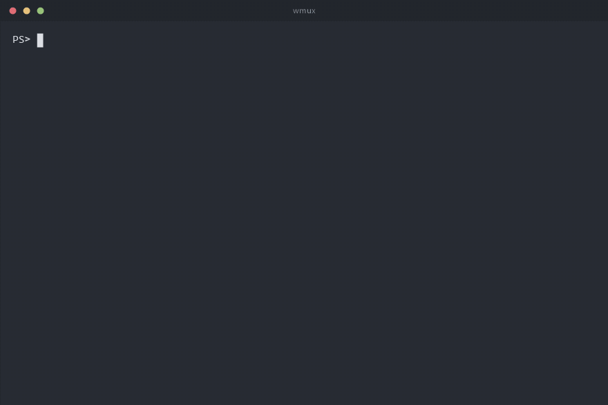
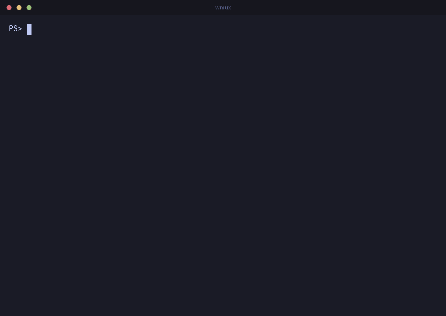
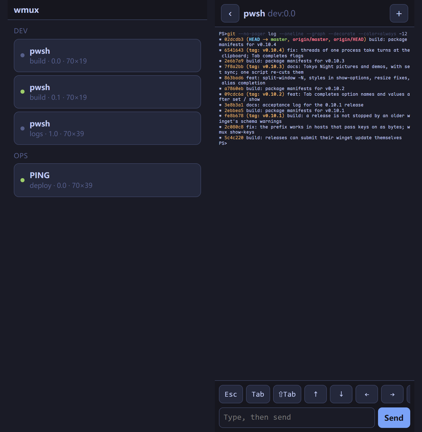

# wmux

[](https://github.com/newdee/wmux/actions/workflows/ci.yml)
[](https://github.com/newdee/wmux/releases)

[中文说明](README.zh-CN.md) · **[Feature tour →](https://dfine.tech/wmux/)**

A tmux-style terminal multiplexer for Windows. Sessions survive closing the
terminal, panes and windows split the screen, and PowerShell, WSL and cmd all
run inside panes with full key fidelity.

<p align="center">
  
</p>

- **Native**: built on ConPTY and the Win32 console API. No Cygwin, no MSYS,
  no WSL requirement. Works in Windows Terminal, the classic console host,
  VS Code's terminal, and anything else that hosts a Windows console.
- **PowerShell and WSL first-class**: keystrokes are forwarded to panes as raw
  Windows key events (the same win32-input-mode protocol Windows Terminal
  uses), so PSReadLine chords, `Ctrl+Space`, `Shift+Enter`, arrows with
  modifiers, IME input and WSL/Linux TUIs behave exactly as they do outside
  wmux.
- **tmux muscle memory**: `C-b` prefix, `%` / `"` to split, `c` for a new
  window, `d` to detach, `[` for copy mode, `:` for a command prompt, the same
  command names on the CLI (`new-session`, `attach`, `ls`, `send-keys`, ...),
  and a `.tmux.conf`-style config file.
- **Background jobs that report back**: a window you are not looking at is
  marked when it prints, rings or goes quiet (`monitor-activity`,
  `C-b M-n` jumps to it), a pane whose program dies can keep its output and
  exit code (`remain-on-exit`), and a resumed session comes back with what
  each pane had on screen (`save-history`).
- **Your panes on your phone**: `wmux web` prints a QR code; scan it on the
  same Wi-Fi and the phone's browser lists every pane, shows any of them as
  it is on the screen, and types into it. No app to install.

<p align="center">
  
</p>

## On your phone

Leave a build, a deploy or an agent running, and check on it from the sofa:

```powershell
wmux web
```

prints a QR code in the terminal. Scan it with the phone's camera (same
network) and the browser opens a page that lists every pane with the program
running in it. Tap one to see its screen, colours and all, kept up to date;
type into it from the box at the bottom, or with the row of keys the phone
keyboard lacks (Esc, Tab, Shift+Tab, arrows, Ctrl+C, y / n / 1 / 2 / 3). The
+ menu splits the pane, opens a window or closes the pane. Everything runs
on the computer; the phone only shows and types. "Add to Home Screen" makes
it open like an app.

<p align="center">
  
</p>

The code carries the address and a key made fresh at each start (128 random
bits); nothing but the page itself answers without it, and the phone can only
look, type into a pane and use that menu: no command of its own reaches wmux.
It is off until started and stops with Ctrl+C.

```powershell
wmux web --read-only     # look, but not type
wmux web --keep-key      # the same code next time, so a bookmark keeps working
wmux web --port 8080 --bind 192.168.1.23   # another port, or another network card
```

It is plain HTTP, meant for your own network: on a shared one, someone
watching the traffic could read the key. From elsewhere, put a private
network such as Tailscale in between and bind to its address. Windows asks
once whether wmux may use the network; allow it for private networks.

## Install

From the [releases page](https://github.com/newdee/wmux/releases):

- `wmux-<version>-windows-x86_64.msi` installs into `Program Files`, puts
  `wmux` on the system `PATH` and uninstalls from "Apps & features"
  (`msiexec /i wmux-<version>-windows-x86_64.msi /qn` for an unattended
  install).
- `wmux-<version>-windows-x86_64.zip` is the same `wmux.exe` to unzip
  wherever you like.

With Scoop, the manifest in this repository installs the zip and keeps
it current:

```powershell
scoop install https://raw.githubusercontent.com/newdee/wmux/master/packaging/scoop/wmux.json
```

WinGet manifests for the MSI are in `packaging/winget/` (validated with
`winget validate`); `winget install newdee.wmux` works once they are
merged into winget-pkgs, and until then
`winget install --manifest packaging/winget/manifests/n/newdee/wmux/<version>`
from a clone does the same. See `packaging/README.md`.

Or build from source, which needs Rust 1.88+:

```powershell
cargo install --git https://github.com/newdee/wmux --locked   # latest master
cargo install --path .                                         # a local clone
```

Requires Windows 10 1809 or newer (ConPTY).

Building the installer yourself needs nothing but the repository; WiX is
downloaded on demand if it is not already installed:

```powershell
cargo build --release
pwsh -File installer/build-msi.ps1        # target\wmux-<version>-windows-x86_64.msi
```

## Use

```powershell
wmux                      # new session, attached
wmux new -s work          # named session
wmux new -d -s bg wsl.exe # detached session running WSL
wmux ls                   # list sessions
wmux attach -t work       # re-attach (works from a different terminal window)
wmux send-keys -t work "git status" Enter
wmux capture-pane -p -t work   # print what the pane shows (-S -200 adds scrollback)
wmux kill-server
```

Any unambiguous prefix of a command name works, as in tmux: `wmux att`,
`wmux lsp`, `wmux splitw -h`. `wmux kill` is refused, because four commands
start that way. `wmux list-commands` prints them all, and
[docs/tmux-parity.md](docs/tmux-parity.md) tracks them against tmux's own
list, command by command and key by key.

Several panes at once: `wmux split-window -N 3` makes three more and tiles
the window (`-d` keeps the focus where it is). A window too small for all of
them keeps the ones that fit and says how many it made.

Inside a session, press the prefix (`Ctrl+b`) and then:

| Key | Action |
| --- | --- |
| `c` / `n` / `p` / `Tab` / `0-9` | new window / next / previous / last / select by index |
| `,` / `&` | rename / kill window |
| `%` / `"` | split left-right / top-bottom |
| `h` `j` `k` `l` or arrows / `o` / `;` | move between panes (vim keys) / next pane / last pane |
| `H` `J` `K` `L`, `Alt`+arrows / `Ctrl`+arrows | resize the current pane by 5 / by 1 |
| `Shift`+arrows | when the window is bigger than this terminal (`window-size` took another client's), pan this client's view by 5 rows / 10 columns; the view follows the cursor again at the next key |
| (moving, resizing, `n` / `p` and `{` / `}` repeat: after the prefix, keep pressing the key for half a second, `repeat-time`) | |
| `S` | toggle `synchronize-panes` (type into every pane of the window; `S` flag on the status line) |
| `C-s` / `C-r` | save the session / restore saved sessions (see Resume) |
| `z` | zoom (toggle) the current pane |
| `x` | kill the current pane |
| `{` / `}` | swap pane with previous / next |
| `q` | show the pane numbers; press one to go there |
| `Space` / `M-1`…`M-5` / `E` | cycle the layout / pick one (even-horizontal, even-vertical, main-horizontal, main-vertical, tiled) / even out the panes next to this one |
| `C-o` / `M-o` | rotate the panes through the layout |
| `!` | break the pane out into its own window |
| `m` / `M` | mark this pane / clear the mark (`join-pane` takes the marked one) |
| `T` / `f` | name this pane / find a window by name or title |
| `[` / `PgUp` | copy mode (see below) |
| `#` / `-` / `=` | list paste buffers / delete the newest / pick one to paste |
| `t` / `~` / `r` | clock / recent messages / redraw |
| `]` | paste the clipboard |
| `:` | command prompt (`:split-window -h -c C:\src`, `:set mouse off`, ...; Tab completes the command, its flags, a `-t` target and option names) |
| `d` | detach |
| `?` | list key bindings |
| `s` / `w` | pick a session / a window from a list (`j` `k` or arrows move, `g` `G` top/bottom, `0-9` jump, `Enter` selects, `q` cancels; `f` filters by a substring as you type, `Enter` keeps it and `Esc` puts the old one back; `t` tags the line, `T` clears the tags, `x` kills the tagged lines, or the current one; `-`/`+` or Left/Right fold and unfold a session) |
| `(` / `)` | switch the client to the previous / next session |
| `D` | pick a client from a list and detach it |
| `>` / `<` | pane menu / window menu (the letter in brackets runs the entry, `Enter` runs the highlighted one) |
| `M-n` / `M-p` | next / previous window with an alert (see `monitor-activity`) |

In copy mode: `h` `j` `k` `l` and the arrows move, `w` `b` `e` walk words,
`0` `^` `$` and `H` `M` `L` and `{` `}` and `g` `G` jump, `PageUp` /
`PageDown` and `C-b` / `C-f` page, `C-u` / `C-d` half-page (with `C-b` as
the prefix, press it twice: `C-b C-b` is copy mode's page-up), a count
repeats (`3j`), `Space` or `v` starts a selection, `C-v` makes it a
rectangle,
`Enter` or `y` copies (to a paste buffer and the Windows clipboard), `/`
searches forward and `?` back through the scrollback with `n` / `N` to
repeat, `q` leaves. A script can drive all of it with
`send-keys -X <command>`, the same command names tmux uses.

Mouse: click selects a pane, drag a border to resize, click a window name on
the status line to select it, wheel scrolls (enters copy mode on the normal
screen, sends arrow keys to full-screen programs, and is passed through to
programs that ask for mouse events). Drag to select text; the selection is
copied to the Windows clipboard on release, and a right click pastes the
clipboard into the pane, as the terminal itself would.

## Resume after a reboot

Every session is saved to its own file under `%LOCALAPPDATA%\wmux\sessions`
whenever its shape changes (windows, panes, layout, names, start commands
and directories) and when the server exits. A reboot, a crash or a
`kill-session` does not lose that file, so:

```powershell
wmux resume              # bring back every saved session, attach to the first
wmux resume work         # bring back (or just attach to) the session "work"
wmux list-saved          # what can be resumed, newest first
wmux delete-saved old    # forget one
wmux save-session -a     # save everything right now (prefix C-s saves the current one)
```

Resuming recreates the pane tree, puts back the last `save-history` lines
each pane had on screen (500 by default; `set -g save-history all` keeps
the whole scrollback, colours included) and starts each pane's original
command in the pane's last known directory. What the programs themselves
were doing does not come back; no multiplexer can do that. Saving happens
by itself: the tree whenever it changes, the pane text every 30 seconds,
and everything once more when Windows shuts down, restarts or you log
off (the server holds the shutdown up for the moment that takes). `set -g
restore-on-start on` makes a fresh server restore everything by itself;
`set -g autosave off` turns saving off; `sessions-dir` moves the files.

To have all of that happen by itself when you log on:

```powershell
wmux startup on          # start the server at logon and restore every saved session
wmux startup status      # what is registered
wmux startup off         # stop doing that
```

This writes one value under the per-user `Run` registry key (no
administrator rights, nothing in Task Scheduler), running the server
through `conhost --headless` so no console window appears at logon. After a
reboot, `wmux attach` finds everything as it was.

Upgrading: installing a new wmux does not replace the server that is
already running, which keeps your sessions and is still the old program.

```powershell
wmux version          # this wmux, and the server's version when it differs
wmux update --check   # is there a newer release?
wmux update           # install it the way this one was installed (MSI or scoop)
wmux restart-server   # move every running session to a server of this version
```

`restart-server` saves the running sessions, stops the old server, starts
one of this version and restores exactly those sessions, layout, history
and directories included; terminals attached to it attach again by
themselves (from 0.10 on; an older server's terminals are detached, and
`wmux attach` takes them back). Run from inside a pane it finishes outside
the pane and writes what it did to `%LOCALAPPDATA%\wmux\restart.log`.
Options and key bindings come from the config file again, as after
`kill-server`: ones typed with `set`/`bind` since are not carried over
(the old server cannot tell them from its defaults, and copying all of
them would pin the old version's defaults on the new one).
While a terminal is attached to a server of another version, its title
says so. `update` downloads the MSI, checks it against the SHA-256
published beside it, and hands it to Windows Installer; nothing is ever
checked or installed in the background.

Tab completion in PowerShell (command names, each command's flags, `-t`
targets from the running server, and option names and values after `set`
/ `show`; aliases like `splitw` and prefixes like `split-w` count as the
command they stand for) comes from a completer the program prints, for
`wmux` and for a `tmux` alias of it; one line in `$PROFILE` loads it.
Windows PowerShell 5.1 does not ask a program's completer about words
starting with `-`, so flags complete in PowerShell 7 only.

```powershell
wmux completion powershell | Out-String | Invoke-Expression
```

Inside wmux, Tab at the `:` prompt completes the command name, its flags
once a `-` is typed (an alias or a prefix counts as its command; a flag
already given is not offered again), a target after `-t`, and after
`set` / `show` the option's name (abbreviations too:
`sync`, `mon-act`) and then its value when it is one of a few (`on`/`off`,
`top`/`bottom`); several candidates are typed as far as they agree and
listed in the prompt.

PowerShell's Ctrl+D does nothing by default (bash's exits), so it does
not close a pane either. To have it exit on an empty line, add to
`$PROFILE`:

```powershell
Set-PSReadLineKeyHandler -Chord Ctrl+d -Function DeleteCharOrExit
```

And to have wmux in the Windows Terminal dropdown:

```powershell
wmux windows-terminal install    # a "wmux" profile that attaches to (or starts) the session "main"
wmux windows-terminal status
wmux windows-terminal remove
```

This is a profile *fragment*, one JSON file of wmux's own under
`%LOCALAPPDATA%\Microsoft\Windows Terminal\Fragments\wmux\`; Windows
Terminal merges it in, `settings.json` is never touched, and the profile
keeps its identity across reinstalls so the font or colours you give it
stay. Every tab opened from it joins the same session, as `tmux new -A -s
main` would.

A pane's directory follows its shell's `cd`, with nothing to set up:
PowerShell (pwsh or Windows PowerShell) is started with a prompt hook that
reports the directory after every prompt (an invisible OSC 9;9; your own
prompt, oh-my-posh and the like included, is left as it is), and for
`cmd.exe` and other programs wmux reads the process's own directory. A
shell that announces its directory itself (OSC 9;9, quoted or not, or OSC 7
from bash/zsh under WSL) is believed first, and `wmux set-cwd` (no argument:
the directory you run it from) sets it by hand:

```bash
# WSL bash: /mnt/<drive>/... paths map back to Windows drives
PROMPT_COMMAND='printf "\e]7;file://%s%s\e\\" "$HOSTNAME" "$PWD"'
```

`list-panes` shows the recorded directory, and `#{pane_current_path}` puts
it on the status line.

## Configuration

`%USERPROFILE%\.wmux.conf` (or `%USERPROFILE%\.config\wmux\wmux.conf`, or
the file named by `WMUX_CONFIG`) holds one command per line, tmux syntax.
With no wmux config at all, an existing `~/.tmux.conf` (or
`~/.config/tmux/tmux.conf`) is read instead: what wmux understands is
applied (`%if` blocks are evaluated, and `bind -T copy-mode-vi v send -X
begin-selection`-style lines bind keys in copy mode), and what it cannot
use (TPM's `@plugin` lines for plugins it does not have, options tmux has
and wmux does not) is skipped and listed in `show-messages` rather than
thrown at you on every attach. Mouse "keys" such as `MouseDragEnd1Pane`
are taken and do nothing: wmux's mouse handling is fixed.

```tmux
set -g prefix C-a
set -g default-shell wsl          # pwsh (default), powershell, wsl, cmd, or a path
# set -g default-command "wsl.exe -d Ubuntu"
set -g mouse on
set -g history-limit 10000
set -g status-position top
set -g status-style fg=black,bg=colour39
set -g pane-active-border-style fg=colour39
set -g base-index 1               # windows and panes counted from 1
set -g pane-base-index 1

set -g repeat-time 500            # how long a `bind -r` key keeps working; 0 disables

set -g remain-on-exit on          # keep a pane whose program exited, showing why
set -g save-history 500           # lines of each pane saved for `resume`; 0 saves none, all saves the whole scrollback
set -g monitor-activity on        # flag a background window that prints (`#` on the status line)
set -g monitor-bell on            # and one that rings the bell (`!`); on by default
set -g monitor-silence 60         # flag one that has said nothing for 60s (`~`); 0 disables
set -g visual-bell on             # say it on the status line instead of ringing

bind -r h select-pane -L          # -r: press h h h after one prefix
bind -r j select-pane -D
bind -r k select-pane -U
bind -r l select-pane -R
bind | split-window -h
bind - split-window -v
bind -n M-Left previous-window     # -n: no prefix
bind -n M-Right next-window
bind r source-file ~/.wmux.conf

set -ag status-right " | wmux"    # -a adds to what the option already holds
source-file ~/.wmux/themes/nord.conf
```

Option names take an unambiguous abbreviation, the way command names do:
`set sync` is `set synchronize-panes`, `set mon-act on` is
`set monitor-activity on`, and each dash-separated word can be shortened
(`set w-s-f "#I:#W"`). An on/off option with no value flips: `set mouse`,
`set sync`. Something that could mean several options says which
(`set mon` lists the three `monitor-*` ones).

Options unknown to wmux but common in `.tmux.conf` (`escape-time`,
`default-terminal`, ...) are accepted and ignored, so an existing tmux config
can be reused as a starting point.

### Themes

`themes/` in this repository holds ready-made colour schemes (Tokyo Night,
which the pictures here wear, Nord, Gruvbox dark, Dracula, Catppuccin
Mocha). They are ordinary wmux commands, so a theme is just a file to source
and an easy thing to copy and edit:

```tmux
source-file ~/.wmux/themes/dracula.conf
```

### Status line

`status-left`, `status-right`, `window-status-format`,
`window-status-current-format` and `pane-border-format` take tmux format
strings: `#S` session, `#W` window name, `#I` window index, `#P` pane
index, `#T` pane title, `#H` host, `#F` flags, `#{session_name}`-style
names, `#{?flag,then,else}` conditionals (`#{?window_flags,busy,idle}`,
`#{?session_name==work,…,…}`), `%H:%M` time fields,
`#[fg=colour39,bg=black,bold]` style changes and `#(command)`, which runs the
command every `status-interval` seconds (default 15) and shows its first
line (a one-shot `display-message -p` or `jobs -F` runs it right away,
giving up after 3 s). `status-left-length` / `status-right-length` clip. `status-justify
left|centre|right|absolute-centre` places the window list, and
`window-status-separator` is what goes between the labels (a space by
default).

Variables: `session_name` `session_id` `session_windows` `session_attached`
`session_created`, `window_name` `window_id` `window_index` `window_panes`
`window_active` `window_last_flag` `window_zoomed_flag` `window_width`
`window_height` `window_bell_flag` `window_activity_flag`
`window_silence_flag` `window_flags`, `pane_index` `pane_id` `pane_title`
`pane_current_command` `pane_start_command` `pane_current_path` `pane_width`
`pane_height` `pane_active` `pane_dead` `pane_dead_status`
`pane_synchronized` `pane_in_mode` `pane_pid` `pane_start_time`
`pane_activity` `pane_dead_time` `pane_last` `pane_mode` `pane_top`
`pane_left` `pane_bottom` `pane_right` `pane_at_top` `pane_at_bottom`
`pane_at_left` `pane_at_right` `cursor_x` `cursor_y` `history_size`
`history_limit`, `client_width` `client_height` `client_name`
`client_session` `client_created` `client_activity` `client_prefix`, `host`
`host_short` `socket_path` `version` `pid`; also `session_activity`
`session_last_attached` `window_activity` `window_start_flag`
`window_end_flag` `window_layout`. The machine, read in-process (no
`#(command)` needed): `cpu_percentage` `ram_percentage` `ram_used`
`battery_percentage` (empty without a battery) `battery_charging` `uptime`,
plus `git_branch` (the branch of the pane's directory, read from `.git`,
empty outside a repository), `pane_current_path_short` (`~` for home) and
`pane_pid_command` (the program the pane is running right now, `cargo`
during a build). The default `status-right` uses them:
`#{?git_branch, #{git_branch} |,} #{pane_current_path_short} | CPU
#{cpu_percentage} MEM #{ram_percentage}#{?battery_percentage, | BAT
#{battery_percentage},} | %H:%M`; `set -g status-right ...` replaces it,
`set -g status off` hides the line. Comparisons as in tmux: `#{==:a,b}`
`#{!=:a,b}` `#{<:a,b}` `#{>:a,b}` `#{<=:a,b}` `#{>=:a,b}` `#{&&:a,b}`
`#{||:a,b}` and `#{m:pattern,text}` (a glob; `m/i:` ignores case) answer
`1` or `0`, and can be the condition of `#{?…}` or of a `%if` in the config
file.
Modifiers, as in tmux: `#{=10:pane_title}` (first 10 characters),
`#{=-10:…}` (last 10), `#{b:pane_current_path}` (basename), `#{d:…}`
(dirname), `#{t:session_created}` (a time as a clock), `#{s/foo/bar/:…}`
(substitution); they nest (`#{=8:b:pane_current_path}`).

`set -g pane-border-status top` (or `bottom`) puts a line of
`pane-border-format` on every pane's border — by default the pane's number
and title, the active pane's in bold.

```tmux
set -g status-right "#[fg=yellow]#(pwsh -NoProfile -c (Get-Date).ToString('HH:mm'))#[default] #H"
```

## Plugins

Plugins work the way tmux plugins do: a plugin is a directory with a
`<name>.wmux` (or `plugin.wmux`) file of wmux commands, plus any scripts it
needs, in any language. Scripts call back through the CLI: `WMUX` holds the
socket name and `WMUX_PANE` the pane, so `wmux -L $env:WMUX display-message
...` from a script reaches the right server.

```tmux
# ~/.wmux.conf
set -g plugin-path ~/.wmux/plugins       # default
set -g @plugin demo                       # ~/.wmux/plugins/demo/demo.wmux
set -g @plugin C:\src\my-plugin           # or a path (dir or file)
```

Inside a plugin file you have everything the config has, plus:

- `run-shell [-b] [-t target] command` runs a command (through pwsh) with
  the wmux environment; its output is shown when it finishes (`-b`: ignore).
- `set-hook -g <hook> <command>` runs a command when something happens:
  `after-new-session`, `after-new-window`, `after-split-window`,
  `after-select-window`, `after-select-pane`, `after-kill-pane`,
  `client-attached`, `client-detached`, `pane-exited`. `set-hook -gu <hook>`
  removes it; `show-hooks` lists them.
- `set -g @anything value` stores a user option; `show-options -gqv @anything`
  reads it back (from a script: `wmux -L $env:WMUX show-options -gqv @anything`).
- `#(command)` pieces on the status line (above).
- `load-plugin name-or-path` and `list-plugins` at runtime.

A minimal plugin that shows an agent's progress file on the status line and
pops the full log with `prefix A`:

```tmux
# ~/.wmux/plugins/agent-status/agent-status.wmux
set -g status-right "#[fg=cyan]#(pwsh -NoProfile -File ~/.wmux/plugins/agent-status/summary.ps1)#[default] %H:%M"
set -g status-interval 5
bind A run-shell "pwsh -NoProfile -Command Get-Content $env:TEMP\agent.log -Tail 30"
```

Commands a script or a binding reaches for, beyond the obvious ones
(`wmux list-commands` prints all 85, and any unambiguous prefix works):

- `pipe-pane [-o] [-I] [-O] [-t target] [command]` copies everything a pane
  prints into a command's standard input (`-O`, the default); with no
  command it stops. `wmux pipe-pane "$input | Add-Content build.log"` keeps
  a build log without touching the build (PowerShell reads all of its input
  before it runs, so that file is written when the pipe stops; a `cmd.exe /c
  findstr ... > file` command writes as lines arrive). `-I` goes the other way: what the
  command prints is typed into the pane, and the pipe ends with the
  command's output (`-IO` does both).
- `wait-for [-L|-U|-S] channel` blocks until another client signals the
  channel (or unlocks it), so two scripts can take turns: `wmux wait-for
  ready` waits, `wmux wait-for -S ready` releases it.
- `display-menu [-T title] name key command ...` opens a menu over the
  window; an empty name is a separator. `display-popup [-E] [-w W] [-h H]
  [-x X] [-y Y] [-d dir] [command]` runs a program in a box over the window
  (`-E` closes it when the program exits, `-C` closes it from outside;
  `-x`/`-y` take a column or row, a percentage, `C` for centred or `R`/`B`
  for the right or bottom edge, and the box is centred without them).
- `choose-client` lists the attached clients and detaches the one picked.
- `send-keys -X <copy-command>` drives copy mode (`search-backward`,
  `begin-selection`, `copy-selection`, ... — the tmux names).
- `capture-pane -p [-e] [-J] [-S -N]` prints a pane, with the colours if
  asked (`-e`), wrapped lines joined back into one (`-J`), N lines of
  scrollback above it (`-S -N`, `-S -` for all of it).
- `find-text pattern` looks through what **every pane has printed**, not
  just the window names, and says where each hit is and how far back:
  `ft:0.0  -8  REDIS-TIMEOUT-here`. `-C` matches case, `-t` narrows to a
  session or window, `-n` caps the hits per pane. Neither tmux nor
  `find-window` can do this: `find-window` searches names and titles.
- `record [-t target] out.cast` writes everything a pane prints from now
  on as an [asciinema](https://asciinema.org) v2 file (resizes included);
  `record -t target` with no path stops. Play it with `asciinema play`, or
  upload it, or embed it in a page: a terminal session someone else can
  watch, not a screenshot.
- `notify [-T title] message` raises a desktop notification (a Windows
  toast, in the Action Center under wmux's own name), and `set -g notify on`
  sends one for every alert, so a job that ends while the terminal is
  behind other windows still reaches you. An alert's toast has a **Go to
  pane** button: it opens a `wmux://` link that runs `focus-pane`, which
  switches every attached client to that pane and brings its window
  forward (best effort: Windows Terminal does not always let a window be
  raised from outside). The first toast registers two entries under
  `HKCU\Software\Classes` (the AppUserModelID and the `wmux:` protocol),
  nothing machine-wide; when a toast cannot be shown a tray balloon is used
  instead.
- `focus-pane %N` is that command on its own: every attached client goes to
  pane `%N` (the id `list-panes` and `#{pane_id}` show).
- `jobs` is the task board: one line per pane on the whole server, with
  whether its program is still running or what it exited with, how long it
  has been up, how long since it last printed, its pid, command and
  directory. `-t session` narrows it; `-F format` prints what you want
  instead (`#{pane_start_time}`, `#{pane_activity}` and `#{pane_dead_time}`
  are the raw times). `prefix B` (`choose-jobs`) is the same board as a
  picker: `Enter` goes to that pane, `x` kills it, `r` restarts it, and the
  rows update in place while it is open.

  ```
  PANE       STATE    UP     IDLE   PID    COMMAND       DIR
  build:0.0  running  2h13m  4s     21608  cargo build   C:\src\wmux
  web:0.0    exit 1   2h13m  1h02m  28748  npm run dev   C:\src\site
  ```

Every window and pane command accepts `-t target` as in tmux:
`session`, `session:window`, `:window`, `session:window.pane`, and the window
part may be an index, a name, `+`, `-` or `!`. `%N` is a pane by its id (as
`list-panes` shows it), which stays the same pane as others come and go;
`list-panes -F` prints a format for each pane. The one exception is
`select-pane`, whose `-t` takes the pane to move to (`next`, `last` or an
index) rather than a window target, next to `-L` `-R` `-U` `-D`.

## How it works

`wmux` is a client. The first invocation starts a detached server process
(`wmux __server`) that owns every session; clients talk to it over a per-user
named pipe (`\\.\pipe\wmux-<user>-<socket>`, choose the socket with `-L`).
Each pane is a ConPTY with a `vt100` terminal model on the server side; the
server composites the visible panes, borders and status line into a frame and
sends only the cells that changed to the attached client, which writes them to
the console with VT sequences. The server exits when its last session ends.

Environment inside panes: `WMUX` (socket name) and `WMUX_PANE` (pane id). A
`wmux` command run inside a pane talks to the server that owns it, the way
`$TMUX` works for tmux, so `wmux ls` from a script or a plugin needs no `-L`.
Server log: `%LOCALAPPDATA%\wmux\server.log` (`WMUX_LOG=debug` for more).
Past 5 MB it becomes `server.log.1` and a new one starts, so a server that
runs for months keeps at most about 10 MB of log.

When a key does nothing (the prefix, say), run `wmux show-keys` in that same
terminal and press it: each key prints what the console handed over and the
key wmux reads it as, and `q` quits. Nothing printed means the program
hosting the terminal kept the key for itself (VS Code, for one, binds
`Ctrl+B`). Hosts that pass input on as bytes rather than key events (SSH,
some remote tools) send `Ctrl+B` as the character 0x02 with no Ctrl flag;
wmux reads control characters the way tmux does, so that is still `C-b`.

The pipe carries a DACL that admits only the creating user (and SYSTEM), the
Windows equivalent of tmux's mode-0700 socket directory. Every pane runs in a
kill-on-close job object, so `kill-pane`, `kill-session` and a server exit
take the whole process tree down (the equivalent of tmux hanging up the
process group), and a slow client console never makes the server buffer
frames without bound: it drops to a full redraw instead.

`vendor/vt100` is vt100 0.16.2 with a one-function fix for a panic when a
pane shrinks through a wide (CJK) character; see `vendor/vt100/WMUX-PATCH.md`.
The server also logs and survives any panic in a command (`server.log`).

## Development

```powershell
cargo test              # unit + pipe-level e2e + real-console tests (spawns cmd.exe panes)
cargo clippy --all-targets
```

The `tests/console.rs` suite runs the real `wmux.exe` inside a ConPTY, so the
console code path (raw input mode, alternate screen, detach cleanup) is
covered without a human at the keyboard.

## Not (yet) implemented

Relative to tmux: multiple clients on the same session share one window
size (`window-size latest|smallest|largest|manual` picks which client sets
it: the one used last, the smallest, the largest, or none but
`resize-window`; a client smaller than that sees its own view of the
window, panned with `Shift`+arrows or `refresh-client -U/-D/-L/-R`, and
following the cursor when a key goes to the pane), only the hooks listed
above, the `choose-tree` filter is a substring rather than a format, and
`display-popup` keeps the prefix key for wmux (`prefix prefix` sends it to
the program in the box).

`docs/tmux-parity.md` has the command-by-command and key-by-key list.
