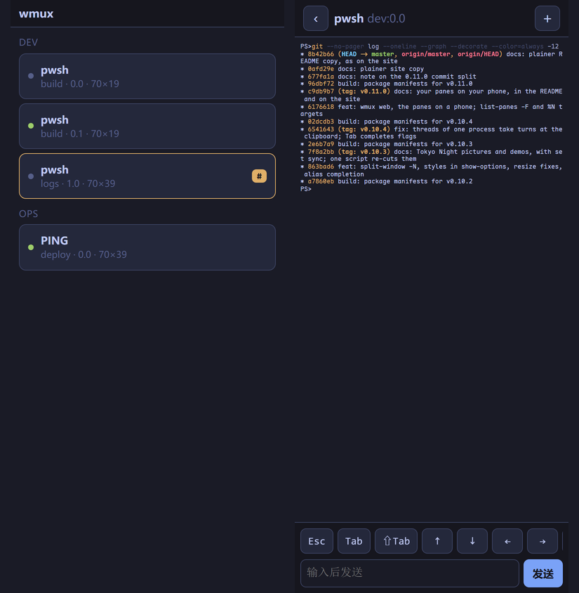

# wmux

[](https://github.com/newdee/wmux/actions/workflows/ci.yml)
[](https://github.com/newdee/wmux/releases)

Windows 上的 tmux。[English](README.md) · **[功能一览 →](https://dfine.tech/wmux/)**

<p align="center">
  
</p>

用过 tmux 的人换到 Windows，最想念的大概就是它：关掉终端窗口，里面跑的东西还在；一个窗口切成几块，各干各的；`prefix d` 走人，回来 `attach` 接着干。wmux 把这套搬到了 Windows 上，而且不是靠 Cygwin 或 MSYS 模拟出来的，是直接用 ConPTY 和 Win32 控制台 API 写的，PowerShell、WSL、cmd 都能在里面正常跑。

- wmux 把键盘事件按 Windows 原生的格式（Windows Terminal 用的那套 win32-input-mode）转给每个 pane，所以 PSReadLine 的组合键、`Ctrl+Space`、`Shift+Enter`、带修饰键的方向键、中文输入法、WSL 里的 vim 和 htop，表现和不用 wmux 时一样。
- 按键和命令都沿用 tmux 的：`Ctrl+b` 前缀，`%` 和 `"` 分屏，`c` 开窗口，`d` 脱离，`[` 进 copy mode，`:` 敲命令。命令行也是那些名字：`new-session`、`attach`、`ls`、`send-keys`……配置文件是 `.tmux.conf` 的语法。
- 每个 session 的布局会自动存盘，重启电脑后 `wmux resume` 就能恢复，连每个 pane 屏幕上的输出一起（`save-history`，默认 500 行）。
- 没在看的窗口有输出就在状态栏标 `#`，响铃标 `!`，太久没动静标 `~`（`monitor-activity`），`prefix M-n` 直接跳过去。程序退出后 pane 也可以留着，写明退出码（`remain-on-exit`）。
- 和 tmux 一样能装插件：插件就是一个目录加几个脚本，用 `run-shell`、hook 和状态栏格式串往里挂东西。
- `wmux web` 在终端里打出一个二维码，同一个 Wi-Fi 下手机扫一下，浏览器里就能看到所有 pane，点进去看屏幕、往里输入，手机上不用装任何东西。

<p align="center">
  
</p>

## 在手机上用

编译、部署或者 AI 助手在电脑上跑着，人走开了也想看一眼、回一句：

```powershell
wmux web
```

终端里会打出一个二维码。手机连同一个网络，用相机扫一下，浏览器就打开一个页面：列出所有 pane、每个 pane 里正在跑的程序，以及状态栏上那几个提醒标记（开了 `monitor-activity` 这类选项时：`#` 有输出，`!` 响铃，`~` 太久没动静），一眼就知道哪个任务跑完了。点进一个，就能看到它的屏幕，颜色都在；屏幕一有变化 wmux 就把新内容推过来，不用等刷新；底部的输入框可以往里打字，还有一排手机键盘上没有的键（Esc、Tab、Shift+Tab、方向键、Ctrl+C、y / n / 1 / 2 / 3）。右上角的 + 菜单可以分屏、开新窗口、关掉当前 pane。命令都在电脑上执行，手机只负责看和输入。“添加到主屏幕”之后，它打开起来就像一个 App。

<p align="center">
  
</p>

二维码里是地址加一个密钥，密钥每次启动重新生成（128 位随机数）。除了页面本身，没有密钥什么都拿不到；手机只能看、往 pane 里输入、用那个 + 菜单，发不了任何自己的 wmux 命令。不启动就不开，按 Ctrl+C 就关。

```powershell
wmux web --read-only     # 只能看，不能输入
wmux web --keep-key      # 下次还用同一个二维码，收藏的网页一直能用
wmux web --port 8080 --bind 192.168.1.23   # 换端口，或者指定网卡
```

用的是普通 HTTP，适合自己家里的网络：在公共网络上，抓包的人能看到密钥。在外面想用，就在中间加一层 Tailscale 这类私有网络，绑定到它的地址。第一次运行时 Windows 会问是否允许 wmux 联网，选“专用网络”允许即可。

## 安装

到 [Releases](https://github.com/newdee/wmux/releases) 下载，两种都有：

- `wmux-<版本>-windows-x86_64.msi`：双击装到 `Program Files`，自动加进系统 `PATH`，以后在“应用和功能”里卸载。要静默装就 `msiexec /i wmux-<版本>-windows-x86_64.msi /qn`。
- `wmux-<版本>-windows-x86_64.zip`：就是一个 `wmux.exe`，解压放哪都行。

用 Scoop 的话，仓库里的清单直接装 zip，以后也跟着更新：

```powershell
scoop install https://raw.githubusercontent.com/newdee/wmux/master/packaging/scoop/wmux.json
```

WinGet 的清单（装 MSI）在 `packaging/winget/`，`winget validate` 通过；合进 winget-pkgs 之后 `winget install newdee.wmux` 就行，在那之前可以在克隆里 `winget install --manifest packaging/winget/manifests/n/newdee/wmux/<版本>`。细节见 `packaging/README.md`。

想自己编译的话（需要 Rust 1.88 以上）：

```powershell
cargo install --git https://github.com/newdee/wmux --locked   # 直接装最新的 master
cargo install --path .                                         # 本地克隆
```

需要 Windows 10 1809 或更新（ConPTY 是那时候加的）。

自己打 MSI 也不用先装什么，脚本发现本机没有 WiX 会自己下一份临时用：

```powershell
cargo build --release
pwsh -File installer/build-msi.ps1        # 产物在 target\wmux-<版本>-windows-x86_64.msi
```

## 日常用法

```powershell
wmux                      # 新开一个 session 并进入
wmux new -s work          # 起个名字
wmux new -d -s bg wsl.exe # 后台开一个跑 WSL 的 session
wmux ls                   # 看看有哪些 session
wmux attach -t work       # 接回去（换一个终端窗口也行）
wmux send-keys -t work "git status" Enter
wmux capture-pane -p -t work   # 把 pane 上的文字打印出来（-S -200 连带回滚）
wmux kill-server
```

命令名可以只写不产生歧义的前缀，和 tmux 一样：`wmux att`、`wmux lsp`、`wmux splitw -h`。`wmux kill` 会被拒绝，因为有四个命令以它开头。`wmux list-commands` 列出全部；和 tmux 的逐条对照在 [docs/tmux-parity.md](docs/tmux-parity.md)，命令和按键都有。

一次开多个 pane：`wmux split-window -N 3` 会再开三个并把窗口平铺（加 `-d` 焦点留在原处）。窗口太小放不下时，放得下的那些会留着，并告诉你开了几个。

进了 session 之后，先按前缀键 `Ctrl+b`，再按：

| 按键 | 作用 |
| --- | --- |
| `c` / `n` / `p` / `Tab` / `0-9` | 新窗口 / 下一个 / 上一个 / 刚才那个 / 按编号跳 |
| `,` / `&` | 重命名 / 关掉当前窗口 |
| `%` / `"` | 左右分 / 上下分 |
| `h` `j` `k` `l`（或方向键）/ `o` / `;` | 在 pane 之间移动（vim 键位）/ 下一个 pane / 刚才那个 pane |
| `H` `J` `K` `L`、`Alt`+方向键 / `Ctrl`+方向键 | 调整当前 pane 大小，每次 5 格 / 1 格 |
| `Shift`+方向键 | 窗口比这个终端大时（`window-size` 听了别的客户端），平移自己的视口，每次 5 行 / 10 列；敲键时视口自动跟着光标 |
| 移动、改大小、`n` / `p`、`{` / `}` 都能连按 | 按一次前缀之后半秒内（`repeat-time`）接着按同一个键就行，不用再按前缀 |
| `z` | 当前 pane 放大到整个窗口，再按一次还原 |
| `x` | 关掉当前 pane |
| `{` / `}` | 和前一个 / 后一个 pane 交换位置 |
| `q` | 每块显示自己的编号，按数字直接跳过去 |
| `Space` / `M-1`…`M-5` / `E` | 轮换布局 / 直接选一种（左右平分、上下平分、主窗在上、主窗在左、平铺）/ 把旁边这一排 pane 拉成等宽等高 |
| `C-o` / `M-o` | 让所有 pane 在布局里轮转一格 |
| `!` | 把当前 pane 拆成一个独立窗口 |
| `m` / `M` | 标记这个 pane / 取消标记（`join-pane` 默认搬走被标记的那个） |
| `T` / `f` | 给这个 pane 起名 / 按名字或标题找窗口 |
| `#` / `-` / `=` | 列出粘贴缓冲区 / 删掉最新的 / 挑一个粘贴 |
| `t` / `~` / `r` | 时钟 / 最近的提示消息 / 重画 |
| `S` | 开关 `synchronize-panes`：敲的东西同时进这个窗口的所有 pane，状态栏会多个 `S` |
| `[` / `PgUp` | copy mode（下面单独说） |
| `]` | 粘贴剪贴板 |
| `:` | 命令行（`:split-window -h -c C:\src`、`:set mouse off` 之类；Tab 补命令名、flag、`-t` 后的目标和选项名） |
| `C-s` / `C-r` | 手动保存当前 session / 恢复保存过的 session |
| `d` | 脱离 |
| `?` | 列出所有按键 |
| `s` / `w` | 弹出 session / 窗口列表挑一个：`j` `k`（或方向键）上下，`g` `G` 到头到尾，数字直接跳，`Enter` 选中，`q` 取消；`f` 输入子串过滤（边打边筛，`Enter` 留下，`Esc` 还原），`t` 给当前行打标记（`T` 清掉），`x` 杀掉标记的行（没标记就是当前行），`-` / `+`（或左右方向键）折叠、展开一个 session |
| `(` / `)` | 切到上一个 / 下一个 session |
| `D` | 列出连着的客户端，挑一个踢下线 |
| `>` / `<` | pane 菜单 / 窗口菜单（括号里的字母直接执行，`Enter` 执行选中那条） |
| `M-n` / `M-p` | 跳到下一个 / 上一个有提醒的窗口（见 `monitor-activity`） |

copy mode 里：`h` `j` `k` `l` 和方向键移动，`w` `b` `e` 按词走，`0` `^` `$`、`H` `M` `L`、`{` `}`、`g` `G` 跳转，`PageUp` / `PageDown` 和 `C-b` / `C-f` 翻页，`C-u` / `C-d` 翻半页（`C-b` 是前缀键，按两下：`C-b C-b` 就是 copy mode 的上翻页），前面加数字就重复（`3j`），`Space` 或 `v` 开始选，`C-v` 切成矩形选择，`Enter` 或 `y` 复制（同时进粘贴缓冲区和 Windows 剪贴板），`/` 往新的方向搜、`?` 往回翻历史搜、`n` `N` 找下一个，`q` 退出。脚本想干同样的事就用 `send-keys -X <命令名>`，命令名和 tmux 一样。

鼠标也管用：点一下选 pane，拖边框调大小，点状态栏上的窗口名切窗口。滚轮在普通界面上会进 copy mode 往回翻，在全屏程序里变成方向键，程序自己要鼠标事件的话就原样转过去。拖选一段文字，松手就复制到 Windows 剪贴板了；右键把剪贴板贴进 pane，和终端本身的右键一样。

## 重启之后接着用

每个 session 的结构（有哪些窗口、每个窗口怎么分的、每块里跑的是什么命令、在哪个目录）都会存成一个文件，放在 `%LOCALAPPDATA%\wmux\sessions` 下面。结构一变就存一次，`kill-server` 的时候也存。所以不管是重启、崩溃还是手滑 `kill-session`，文件都还在：

```powershell
wmux resume              # 把存过的 session 全恢复出来，进第一个
wmux resume work         # 只恢复 work（要是它本来就在跑，那就直接进去）
wmux list-saved          # 有哪些能恢复，最新的排前面
wmux delete-saved old    # 不要了
wmux save-session -a     # 现在就全存一遍（prefix C-s 存当前这个）
```

恢复出来的是布局、每个 pane 的启动命令、所在目录，还有每块屏幕上最后 `save-history` 行（默认 500 行；`set -g save-history all` 把整段 scrollback 连颜色一起存下来）的输出。程序当时跑到哪是回不来的，谁也做不到。存档是自动的：布局一变就存，pane 上的文字每 30 秒存一次，Windows 关机、重启、注销时再整个存一遍（server 会把关机拖住那一瞬间）。想让 server 一启动就自己恢复，配置里写 `set -g restore-on-start on`；不想存就 `set -g autosave off`；`sessions-dir` 可以换目录。

想让这一切在开机登录时自动发生：

```powershell
wmux startup on          # 登录时启动 server，把存过的 session 全恢复出来
wmux startup status      # 看看注册了什么
wmux startup off         # 取消
```

它只在当前用户的 `Run` 注册表键下写一个值，不需要管理员权限，也不碰任务计划；server 通过 `conhost --headless` 启动，登录时不会闪出控制台窗口。重启之后 `wmux attach` 进去，东西都在。

升级：装了新版 wmux，已经在跑的 server 不会被换掉。它还是旧程序，你的 session 都在它里面。

```powershell
wmux version          # 这个 wmux 的版本；server 版本不同时一并显示
wmux update --check   # 有没有新版
wmux update           # 按当初的安装方式（MSI 或 scoop）装新版
wmux restart-server   # 把正在跑的 session 全部挪到新版本的 server
```

`restart-server` 会先存档正在跑的 session，停掉旧 server，起一个新版本的，再只恢复刚才在跑的那几个（布局、历史、目录都在）；接着的终端会自己重新接上（0.10 起；更老的 server 上的终端会被断开，`wmux attach` 接回去）。在 pane 里面运行时，它会跑到 pane 外面去完成，结果写进 `%LOCALAPPDATA%\wmux\restart.log`。选项和按键绑定会重新从配置文件读，和 `kill-server` 之后一样：之后用 `set` / `bind` 临时改的不会带过去（旧 server 分不清哪些是默认值、哪些是你改的，全搬过去会把旧版本的默认值钉在新版本上）。终端接着一个不同版本的 server 时，标题栏会提示。`update` 下载 MSI 后先核对旁边发布的 SHA-256 再交给 Windows Installer；任何检查和安装都不会在后台偷偷进行。

PowerShell 里的 Tab 补全（命令名、每条命令的 flag、`-t` 后面从运行中的 server 取 session / 窗口名、`set` / `show` 后面的选项名和取值；`splitw` 这样的别名、`split-w` 这样的前缀都按它代表的命令补）由程序自己吐出一段补全脚本，对 `wmux` 和别名成 `tmux` 的都有效。Windows PowerShell 5.1 不会拿 `-` 开头的词来问程序的补全脚本，所以 flag 只在 PowerShell 7 里能补。`$PROFILE` 里加一行就有：

```powershell
wmux completion powershell | Out-String | Invoke-Expression
```

wmux 里面 `:` 命令行按 Tab 也能补：命令名、输到 `-` 时这条命令的 flag（别名和前缀按它代表的命令算，已经写过的不再列）、`-t` 后面的目标、`set` / `show` 后面的选项名（缩写也行：`sync`、`mon-act`），以及只有几个取值的选项的值（`on`/`off`、`top`/`bottom`）；多个候选时补到相同的部分为止，候选列在提示符里。

PowerShell 默认不给 Ctrl+D 绑任何功能（bash 里是退出），所以它也关不掉 pane。想让它在空行上退出，在 `$PROFILE` 里加一行：

```powershell
Set-PSReadLineKeyHandler -Chord Ctrl+d -Function DeleteCharOrExit
```

想让 wmux 出现在 Windows Terminal 的下拉菜单里：

```powershell
wmux windows-terminal install    # 一个 "wmux" profile，打开就接上（或新建）名为 main 的 session
wmux windows-terminal status
wmux windows-terminal remove
```

这是一个 profile *片段*，也就是 wmux 自己的一个 JSON 文件，放在 `%LOCALAPPDATA%\Microsoft\Windows Terminal\Fragments\wmux\` 下，Windows Terminal 会把它合并进来，不碰你的 `settings.json`；重装也保持同一个 profile 身份，你给它改的字体、配色都还在。从它开的每个标签页都进同一个 session，和 `tmux new -A -s main` 一样。

### pane 记住自己在哪个目录

pane 的目录跟着 shell 的 `cd` 走，不用你配置：启动 PowerShell（pwsh 或 Windows PowerShell）时 wmux 挂一个 prompt 钩子，每次提示符后面追加一段不可见的 OSC 9;9 上报目录（你自己的 prompt、oh-my-posh 之类照旧）；`cmd.exe` 和其他程序则直接读进程自己的工作目录。shell 自己上报的目录（OSC 9;9，带不带引号都行；WSL 里 bash/zsh 的 OSC 7）优先采信，`wmux set-cwd`（不带参数就是你运行它时所在的目录）可以手动指定，也可以 `wmux set-cwd -t work:0.1 D:\proj` 给别的 pane 指定。

WSL 里的 bash 用 OSC 7 上报，`/mnt/c/...` 这样的路径会自动映射回 `C:\...`：

```bash
PROMPT_COMMAND='printf "\e]7;file://%s%s\e\\" "$HOSTNAME" "$PWD"'
```

`list-panes` 能看到每个 pane 记的目录，状态栏里用 `#{pane_current_path}` 显示。

## 配置

没有 `.wmux.conf` 的话，wmux 会直接读你现成的 `~/.tmux.conf`（或 `~/.config/tmux/tmux.conf`）：认识的照做（`%if` 块会求值，`bind -T copy-mode-vi v send -X begin-selection` 这类行会在 copy mode 里绑键），不认识的（没装的 TPM `@plugin`、tmux 有而 wmux 没有的选项）跳过并记进 `show-messages`，不会每次 attach 都糊你一脸报错。`MouseDragEnd1Pane` 这类鼠标“键”照收不误、不起作用：wmux 的鼠标行为是固定的。

配置文件是 `%USERPROFILE%\.wmux.conf`（也可以放 `%USERPROFILE%\.config\wmux\wmux.conf`，或者用 `WMUX_CONFIG` 环境变量指定），一行一条命令，就是 tmux 那种写法：

```tmux
set -g prefix C-a
set -g default-shell wsl          # pwsh（默认）、powershell、wsl、cmd，或者可执行文件路径
# set -g default-command "wsl.exe -d Ubuntu"
set -g mouse on
set -g history-limit 10000
set -g status-position top
set -g status-style fg=black,bg=colour39
set -g pane-active-border-style fg=colour39
set -g base-index 1               # 窗口和 pane 都从 1 开始编号
set -g pane-base-index 1
set -g repeat-time 500            # `bind -r` 的键在多久之内还能接着按；0 就是关掉

set -g remain-on-exit on          # 程序退出后 pane 留着，告诉你它是怎么没的
set -g save-history 500           # 每个 pane 存多少行给 `resume` 用；0 就是不存，all 是整段 scrollback
set -g monitor-activity on        # 后台窗口有输出就在状态栏标 `#`
set -g monitor-bell on            # 响铃标 `!`；默认就是开的
set -g monitor-silence 60         # 60 秒没动静标 `~`；0 是关掉
set -g visual-bell on             # 用状态栏提示代替真的响铃

bind | split-window -h
bind - split-window -v
bind -r C-h resize-pane -L 5      # -r：按一次前缀之后可以连着按
bind -n M-Left previous-window     # -n：不用按前缀
bind -n M-Right next-window
bind r source-file ~/.wmux.conf

# 选项名和命令名一样可以缩写，只要不产生歧义：
# set sync          = set synchronize-panes（不给值就是切换）
# set mon-act on    = set monitor-activity on（按 - 分段各写前缀）
# set mou           = 翻转 mouse
# set mon           会报歧义，并列出三个 monitor-* 让你选

set -ag status-right " | wmux"    # -a 是往原值后面追加，不是覆盖
source-file ~/.wmux/themes/nord.conf
```

仓库里的 `themes/` 放了几套现成配色（Tokyo Night，也就是这里截图用的那套，还有 Nord、Gruvbox dark、Dracula、Catppuccin Mocha）。它们就是普通的 wmux 命令文件，`source-file` 一下就行，想改直接改。

`.tmux.conf` 里常见但 wmux 用不上的选项（`escape-time`、`default-terminal` 这些）会被接受然后忽略，所以现成的 tmux 配置可以直接拿来改。

所有窗口和 pane 命令都支持 tmux 风格的 `-t`：`session`、`session:window`、`:window`、`session:window.pane`，窗口那一段可以是编号、名字、`+`、`-` 或 `!`。`%N` 是按编号指定 pane（`list-panes` 里显示的那个），别的 pane 增减时它指的还是同一个；`list-panes -F` 按格式串逐个 pane 输出。

### 状态栏

`set -g pane-border-status top`（或 `bottom`）会在每个 pane 的边框上放一行 `pane-border-format` 的内容，默认是 pane 编号和标题，当前 pane 加粗。

`status-left`、`status-right`、`window-status-format`、`window-status-current-format`、`pane-border-format` 接受 tmux 的格式串：`#S` session 名，`#W` 窗口名，`#I` 窗口编号，`#P` pane 编号，`#T` pane 标题，`#H` 主机名，`#F` 标记，`#{session_name}` 这种长写法，`#{?条件,真,假}` 条件（条件可以是变量名，也可以是 `变量==值` / `变量!=值`），`%H:%M` 之类的时间字段，`#[fg=colour39,bg=black,bold]` 改样式，还有 `#(命令)`：每隔 `status-interval` 秒（默认 15）跑一次，取输出的第一行（`display-message -p`、`jobs -F` 这种一次性命令会当场跑，最多等 3 秒）。`status-left-length` / `status-right-length` 限制长度。`status-justify left|centre|right|absolute-centre` 决定窗口列表放在哪，`window-status-separator` 是窗口标签之间的分隔（默认一个空格）。

```tmux
set -g status-right "#[fg=yellow]#(pwsh -NoProfile -c (Get-Date).ToString('HH:mm'))#[default] #H"
```

能用的变量：`session_name` `session_id` `session_windows` `session_attached` `session_created`、`window_name` `window_id` `window_index` `window_panes` `window_active` `window_last_flag` `window_zoomed_flag` `window_width` `window_height` `window_bell_flag` `window_activity_flag` `window_silence_flag` `window_flags`、`pane_index` `pane_id` `pane_title` `pane_current_command` `pane_start_command` `pane_current_path` `pane_width` `pane_height` `pane_active` `pane_dead` `pane_dead_status` `pane_synchronized` `pane_in_mode` `pane_pid` `pane_start_time` `pane_activity` `pane_dead_time` `pane_last` `pane_mode` `pane_top` `pane_left` `pane_bottom` `pane_right` `pane_at_top` `pane_at_bottom` `pane_at_left` `pane_at_right` `cursor_x` `cursor_y` `history_size` `history_limit`、`client_width` `client_height` `client_name` `client_session` `client_created` `client_activity` `client_prefix`、`host` `host_short` `socket_path` `version` `pid`，另有 `session_activity` `session_last_attached` `window_activity` `window_start_flag` `window_end_flag` `window_layout`。机器本身的信息，进程内直接读、不用 `#(命令)`：`cpu_percentage` `ram_percentage` `ram_used` `battery_percentage`（没电池就是空）`battery_charging` `uptime`；还有 `git_branch`（pane 所在目录的分支，读 `.git` 得来，不在仓库里就是空）、`pane_current_path_short`（家目录写成 `~`）、`pane_pid_command`（pane 里此刻在跑的程序，编译时是 `cargo`）、`pane_output_count`（pane 输出过多少次；脚本比较前后两次的值就知道有没有新输出，只精确到秒的 `pane_activity` 做不到）。默认的 `status-right` 就用它们：`#{?git_branch, #{git_branch} |,} #{pane_current_path_short} | CPU #{cpu_percentage} MEM #{ram_percentage}#{?battery_percentage, | BAT #{battery_percentage},} | %H:%M`；`set -g status-right ...` 整条换掉，`set -g status off` 整行关掉。比较写法和 tmux 一样：`#{==:a,b}` `#{!=:a,b}` `#{<:a,b}` `#{>:a,b}` `#{<=:a,b}` `#{>=:a,b}` `#{&&:a,b}` `#{||:a,b}`、`#{m:通配符,文本}`（`m/i:` 忽略大小写）得到 `1` 或 `0`，可以做 `#{?…}` 的条件，也可以做配置文件里 `%if` 的条件。修饰符和 tmux 一样：`#{=10:pane_title}` 取前 10 个字符，`#{=-10:…}` 取后 10 个，`#{b:pane_current_path}` 取文件名部分，`#{d:…}` 取目录部分，`#{t:session_created}` 把时间戳显示成时间，`#{s/foo/bar/:…}` 替换，可以套着用（`#{=8:b:pane_current_path}`）。

## 插件

插件的玩法和 tmux 一样：一个目录，里面放一个 `<名字>.wmux`（或 `plugin.wmux`）写 wmux 命令，再放上它需要的脚本，什么语言都行。脚本要和 wmux 说话就调命令行：环境变量 `WMUX` 是 socket 名，`WMUX_PANE` 是所在 pane，所以脚本里写 `wmux -L $env:WMUX display-message ...` 就能找到对的 server。

```tmux
# ~/.wmux.conf
set -g plugin-path ~/.wmux/plugins       # 默认就是这里
set -g @plugin demo                       # 加载 ~/.wmux/plugins/demo/demo.wmux
set -g @plugin C:\src\my-plugin           # 也可以直接给路径（目录或文件）
```

插件文件里能用配置文件的全部命令，再加上：

- `run-shell [-b] [-t target] 命令`：通过 pwsh 跑一条命令，带着 wmux 的环境变量，跑完把输出显示出来（`-b` 就不管输出了）。
- `set-hook -g <钩子> <命令>`：某件事发生时执行一条命令。钩子有 `after-new-session`、`after-new-window`、`after-split-window`、`after-select-window`、`after-select-pane`、`after-kill-pane`、`client-attached`、`client-detached`、`pane-exited`。`set-hook -gu <钩子>` 取消，`show-hooks` 查看。
- `set -g @随便什么 值` 存一个插件自己用的选项，`show-options -gqv @随便什么` 读回来（脚本里：`wmux -L $env:WMUX show-options -gqv @随便什么`）。
- 状态栏里的 `#(命令)`，见上面。
- 运行时 `load-plugin 名字或路径`、`list-plugins`。

举个例子，一个把 agent 任务进度显示在状态栏、按 `prefix A` 弹出完整日志的小插件：

```tmux
# ~/.wmux/plugins/agent-status/agent-status.wmux
set -g status-right "#[fg=cyan]#(pwsh -NoProfile -File ~/.wmux/plugins/agent-status/summary.ps1)#[default] %H:%M"
set -g status-interval 5
bind A run-shell "pwsh -NoProfile -Command Get-Content $env:TEMP\agent.log -Tail 30"
```

脚本和按键绑定里常用、但不那么显眼的几个命令（`wmux list-commands` 会列出全部 85 个，命令名写前缀就行）：

- `pipe-pane [-o] [-I] [-O] [-t 目标] [命令]`：把 pane 打印的所有东西灌进一个命令的标准输入（`-O`，默认）；不给命令就是停。`wmux pipe-pane "$input | Add-Content build.log"` 就能一边编译一边留日志（PowerShell 会先把输入读完再跑，所以这个文件是管道停下时才写；想逐行落盘用 `cmd.exe /c findstr ... > 文件` 这种命令）。`-I` 反过来：命令打印什么就往 pane 里敲什么，命令输出完管道就结束（`-IO` 两个方向都要）。
- `wait-for [-L|-U|-S] 通道`：挂在那儿等别人发信号（或者解锁），两个脚本可以互相等：一边 `wmux wait-for ready`，另一边 `wmux wait-for -S ready` 放行。
- `display-menu [-T 标题] 名字 键 命令 ...`：在窗口上弹个菜单，名字给空字符串就是一条分隔线。`display-popup [-E] [-w 宽] [-h 高] [-x 列] [-y 行] [-d 目录] [命令]` 是在窗口上开个小框跑程序（`-E` 程序退出就关，`-C` 从外面关掉；`-x` / `-y` 可以是列号/行号、百分比、`C` 居中、`R` / `B` 贴右边/底边，不给就居中）。
- `choose-client`：列出连着的客户端，选一个踢下线。
- `send-keys -X <copy 命令>`：用脚本开 copy mode 干活（`search-backward`、`begin-selection`、`copy-selection` ……名字和 tmux 一样）。
- `capture-pane -p [-e] [-J] [-S -N]`：把 pane 的内容打出来，`-e` 连颜色一起，`-J` 把被折行的长行拼回一行，`-S -N` 带上 N 行回滚（`-S -` 全部）。
- `find-text 关键词`：在所有 pane 打印过的内容里找，告诉你在哪个 pane、往回第几行：`ft:0.0  -8  REDIS-TIMEOUT-here`。`-C` 区分大小写，`-t` 限定 session 或窗口，`-n` 限制每个 pane 最多几条。wmux 的 `find-window` 只搜窗口名和标题。
- `jobs`：任务板。整个 server 上每个 pane 一行：程序还在跑还是已经退出（退出码多少）、跑了多久、多久没有输出、pid、命令、目录。`-t session` 只看一个 session；`-F 格式` 自己定输出（`#{pane_start_time}`、`#{pane_activity}`、`#{pane_dead_time}` 是原始时间戳）。`prefix B`（`choose-jobs`）是同一张板的可操作版：`Enter` 跳到那个 pane，`x` 杀掉，`r` 重启，开着的时候行会原地刷新。

  ```
  PANE       STATE    UP     IDLE   PID    COMMAND       DIR
  build:0.0  running  2h13m  4s     21608  cargo build   C:\src\wmux
  web:0.0    exit 1   2h13m  1h02m  28748  npm run dev   C:\src\site
  ```
- `record [-t 目标] out.cast`：从现在起把这个 pane 打印的一切写成 [asciinema](https://asciinema.org) v2 文件（连窗口尺寸变化一起）；`record -t 目标` 不带路径就是停。`asciinema play` 能回放，也能上传或嵌进网页。
- `notify [-T 标题] 消息`：弹一个 Windows 桌面通知（toast，通知中心里以 wmux 自己的名字出现）；`set -g notify on` 之后每次告警都弹，终端被别的窗口盖住时也能收到。告警的通知带一个“Go to pane”按钮：点了打开一个 `wmux://` 链接，执行 `focus-pane`，让所有接着的客户端切到那个 pane 并把窗口提到前面（尽力而为：Windows Terminal 不一定允许别的进程把它拉到前台）。第一次弹 toast 会在 `HKCU\Software\Classes` 下登记两个键（AppUserModelID 和 `wmux:` 协议），不碰系统范围；弹不出 toast 时退回托盘气泡。
- `focus-pane %N`：单独用这条命令，所有接着的客户端都切到 pane `%N`（`list-panes` 和 `#{pane_id}` 显示的那个 id）。

窗口和 pane 相关的命令都接受 `-t 目标`，写法和 tmux 一样：`session`、`session:窗口`、`:窗口`、`session:窗口.pane`，窗口那段可以是编号、名字，也可以是 `+`、`-`、`!`。只有 `select-pane` 例外，它的 `-t` 跟的是要跳到哪个 pane（`next`、`last` 或编号），和 `-L` `-R` `-U` `-D` 是一类。

## 它是怎么工作的

`wmux` 这个命令本身是个客户端。第一次运行时它会拉起一个后台 server（`wmux __server`），所有 session 都归 server 管；客户端和 server 之间走一条按用户隔离的命名管道（`\\.\pipe\wmux-<用户名>-<socket>`，`-L` 可以换 socket）。每个 pane 是一个 ConPTY，server 这边用 `vt100` 维护一份终端画面；server 把可见的 pane、边框、状态栏拼成一帧，只把变化的格子发给接上来的客户端，客户端用 VT 序列写到控制台。最后一个 session 结束，server 就退出。

pane 里能看到两个环境变量：`WMUX`（socket 名）和 `WMUX_PANE`（pane 编号）。在 pane 里敲 `wmux` 命令会自动连到管着这个 pane 的 server（和 tmux 用 `$TMUX` 一个道理），所以 `wmux ls` 之类不用再写 `-L`。server 的日志在 `%LOCALAPPDATA%\wmux\server.log`，`WMUX_LOG=debug` 会记得更详细。超过 5 MB 会改名为 `server.log.1` 再开新文件，跑几个月的 server 日志也最多占 10 MB 左右。

某个键按了没反应（比如前缀键），就在同一个终端里运行 `wmux show-keys` 再按它：每按一个键，会打印控制台交过来的是什么、wmux 把它认成哪个键，按 `q` 退出。什么都没打印，说明是外面托管终端的程序自己把键吃掉了（比如 VS Code 自己绑了 `Ctrl+B`）。有些宿主把输入当字节转交而不是键盘事件（SSH、一些远程工具），`Ctrl+B` 到这里只是字符 0x02、不带 Ctrl 标志；wmux 按 tmux 的读法解读控制字符，所以它照样是 `C-b`。

命名管道带了只允许当前用户（和 SYSTEM）访问的 DACL，相当于 tmux 那个 0700 的 socket 目录。每个 pane 都跑在一个 kill-on-close 的 job object 里，所以 `kill-pane`、`kill-session`、server 退出都会把整棵进程树带走，不留孤儿。客户端写控制台慢的时候，server 不会无限缓冲帧，而是直接改成全量重绘。

`vendor/vt100` 是 vt100 0.16.2 加了一处修复：pane 缩小时刚好切到一个宽字符（比如中文）会越界，详见 `vendor/vt100/WMUX-PATCH.md`。server 里任何一条命令 panic 都会记到日志里然后继续跑，不会把 session 全丢了。

## 开发

```powershell
cargo test              # 单元测试 + 管道层的端到端测试 + 真实控制台测试（会拉起 cmd.exe）
cargo clippy --all-targets
```

`tests/console.rs` 会把真的 `wmux.exe` 塞进一个 ConPTY 里跑，所以控制台那条路（raw 模式、备用屏幕、脱离时的清理）不用人坐在键盘前也能测到。

## 还没做的

和 tmux 比：多个客户端接同一个 session 时窗口尺寸是一样的（`window-size latest|smallest|largest|manual` 决定听谁的：最后在用的那个、最小的、最大的、或者谁都不听只认 `resize-window`）；比窗口小的客户端看到的是自己的一块视口，`Shift`+方向键（`refresh-client -U/-D/-L/-R`）平移，敲键时跟着光标走；钩子只有上面列的那几个；`choose-tree` 的过滤是按子串，不是 tmux 的格式串；`display-popup` 里前缀键还是 wmux 的（连按两次前缀可以把它送给弹窗里的程序）。

命令和按键逐条对照见 `docs/tmux-parity.md`。
